# Core Engine Services Map (gamemd.exe → vera20k)

**Status:** synthesis / connected map. Authority order = binary → Ghidra → docs; the 18 studied
per-service profiles + 23 frontier edge profiles under `docs/research/core-services-map/*.md` are
the primary evidence base here (studied profiles Ghidra-verified with cited addresses; frontier
profiles prior-doc / cross-doc-convergent — see §7). gamemd.exe image base `0x400000`.
Per-tick spine = `LogicClass::PerTickUpdate @ 0x0055AFB0` (sole caller `Main_Tick @ 0x0055D360`).
Render pass = `RenderFrame_main @ 0x004F4480` → `TacticalClass::Draw @ 0x006D3D10` (3-pass) →
`Tactical_ObjectRenderingLoop @ 0x006D8DB0`; audio off-thread via 3 mixers (C1/C2/C3).

This document connects all core engine services into one graph. The **18 studied** services have
full substrate profiles (`core-services-map/<slug>.md`). The **23 frontier** services are now
**profiled** as well — each has a full `core-services-map/frontier-<slug>.md` edge profile (render,
audio, net, object-satellite, asset, save/load, input, and the AI tier). The AI services
(`frontier-trigger`, `frontier-ai-team`, `frontier-ai-house`, `frontier-ai-trigger`) are
**structural-only** (registry/struct/tick-position profiled; AI *decision* logic deferred — see §7).
A handful of representative addresses remain UNVERIFIED-this-session (Ghidra MCP was unreachable
during the frontier pass; addresses carry prior-doc citations) — tracked in §7.

---

## §1 Catalog — every core engine service

### Studied (18) — full substrate profile under `core-services-map/`

| Slug | One-line purpose | Doc |
|---|---|---|
| `logicclass` | Per-tick spine: active-object vector `0x0087F778` + driver `PerTickUpdate 0x0055AFB0` running a fixed global-rung ladder + one ordered object-AI fan-out per frame; defines the order every other per-tick service runs in. | `core-services-map/logicclass.md` |
| `abstract-object` | Root object hierarchy (AbstractClass→ObjectClass): identity, world coords, health, cell occupancy, limbo↔active lifecycle FSM, active-vector membership, selection, save/load — the entity-store + lifecycle chokepoint. | [core-services-map/abstract-object.md](https://github.com/YuriPlanet/vera20k/blob/108924bc237d14342b68b8bb78f2bba0400d2443/docs/research/core-services-map/abstract-object.md) |
| `techno-foot` | Per-object update layer: the AI spine (Leaf::AI → FootClass::AI → TechnoClass::AI_Update → Mission_Dispatch → locomotor Process) run for every live object each tick. | [core-services-map/techno-foot.md](https://github.com/YuriPlanet/vera20k/blob/108924bc237d14342b68b8bb78f2bba0400d2443/docs/research/core-services-map/techno-foot.md) |
| `mission-radio` | Per-object mission scheduler (CurrentMission + Mission_Dispatch switch + frame-anchored timer + Assign/Queue/Commence/Override/Restore) + synchronous RadioClass contact RPC bus carrying dock/board/tether/repair handshakes. | [core-services-map/mission-radio.md](https://github.com/YuriPlanet/vera20k/blob/108924bc237d14342b68b8bb78f2bba0400d2443/docs/research/core-services-map/mission-radio.md) |
| `random-scenario` | Session substrate: deterministic R(250,103) RNG streams (Scen->Random / g_MainRng / g_MapGenRng) + loaded-scenario singleton (identity, map metadata, waypoints, per-map flags). | [core-services-map/random-scenario.md](https://github.com/YuriPlanet/vera20k/blob/108924bc237d14342b68b8bb78f2bba0400d2443/docs/research/core-services-map/random-scenario.md) |
| `rules-class` | Global parsed-INI gameplay-tunables singleton (`0x008871E0`): all game-wide tuning constants loaded once at scenario init, served read-only. | [core-services-map/rules-class.md](https://github.com/YuriPlanet/vera20k/blob/108924bc237d14342b68b8bb78f2bba0400d2443/docs/research/core-services-map/rules-class.md) |
| `cell-map` | Spatial substrate: MapClass 512×512 CellClass* grid (`g_Map 0x0087F7E8`) + lookup/playfield/zone/bridge/shroud/crate services; CellClass = 328-byte per-cell record. | [core-services-map/cell-map.md](https://github.com/YuriPlanet/vera20k/blob/108924bc237d14342b68b8bb78f2bba0400d2443/docs/research/core-services-map/cell-map.md) |
| `factory-house` | Per-house economy/power/prereqs/diplomacy (HouseClass) + per-(house,category) 54-step pay-as-you-go production state machine (FactoryClass) — the production tick and the wallet. | [core-services-map/factory-house.md](https://github.com/YuriPlanet/vera20k/blob/108924bc237d14342b68b8bb78f2bba0400d2443/docs/research/core-services-map/factory-house.md) |
| `damage-helpers` | Warhead/armor damage kernel + AoE distributor: (raw damage, warhead, armor, distance, mods, immunity) → ftol-truncated HP delta with MaxDamage cap; fans one detonation to many targets. | [core-services-map/damage-helpers.md](https://github.com/YuriPlanet/vera20k/blob/108924bc237d14342b68b8bb78f2bba0400d2443/docs/research/core-services-map/damage-helpers.md) |
| `cell-validation` | Read-only cell-legality primitives: rectangle passability/occupancy, diamond-ring nearby-passable search, `y*0x200+x` cell lookup with dummy fallback. | [core-services-map/cell-validation.md](https://github.com/YuriPlanet/vera20k/blob/108924bc237d14342b68b8bb78f2bba0400d2443/docs/research/core-services-map/cell-validation.md) |
| `bridge-helpers` | Read-only bridge-topology service: IsBridge/IsWood/IsLow/anchor/bridgehead predicates, effective deck height, CheckBridgeTraversal gate, AoE/occupancy/render layer selectors. | [core-services-map/bridge-helpers.md](https://github.com/YuriPlanet/vera20k/blob/108924bc237d14342b68b8bb78f2bba0400d2443/docs/research/core-services-map/bridge-helpers.md) |
| `ini-parsing` | CCINIClass typed-accessor layer over INIClass: (section,key,default) → typed values with gamemd-exact parse rules; the load-time data substrate. | [core-services-map/ini-parsing.md](https://github.com/YuriPlanet/vera20k/blob/108924bc237d14342b68b8bb78f2bba0400d2443/docs/research/core-services-map/ini-parsing.md) |
| `pathfinding-helpers` | Path-search helper layer over A*: zone classification, per-neighbor edge cost, hierarchical zone-corridor Dijkstra + marker gate, mover-gated slope/bridge fallback. | [core-services-map/pathfinding-helpers.md](https://github.com/YuriPlanet/vera20k/blob/108924bc237d14342b68b8bb78f2bba0400d2443/docs/research/core-services-map/pathfinding-helpers.md) |
| `target-scoring` | Per-unit "what do I shoot at": scan region → gate → integer threat score → best target by strictly-greater + scan-order tie-break (Calculate_Threat_Score → Evaluate_Candidate → Greatest_Threat). | [core-services-map/target-scoring.md](https://github.com/YuriPlanet/vera20k/blob/108924bc237d14342b68b8bb78f2bba0400d2443/docs/research/core-services-map/target-scoring.md) |
| `drawing-helpers` | Render-side draw-primitive substrate: object draw order (two-pass 5-layer), screen/FLH math, layer/Y-sort + z resolution, palette/remap, DrawExtras placement. Strictly downstream of `sim/`. | [core-services-map/drawing-helpers.md](https://github.com/YuriPlanet/vera20k/blob/108924bc237d14342b68b8bb78f2bba0400d2443/docs/research/core-services-map/drawing-helpers.md) |
| `lookup-tables` | Pure read-only static lookup-table substrate (facing/lepton deltas, drive-track, cell-spread AoE spiral, A* geometry/cost, bridge classifiers, passability/speed matrix, remap/palette/sound tables). No mutable state, no RNG. | [core-services-map/lookup-tables.md](https://github.com/YuriPlanet/vera20k/blob/108924bc237d14342b68b8bb78f2bba0400d2443/docs/research/core-services-map/lookup-tables.md) |
| `gadget-dialog` | Framework A retained-mode in-game gadget tree: per-tick input+draw authority for all in-game chrome (sidebar/cameos/command bar/radar/tactical catchers/chat) with 3-tier dispatch. | [core-services-map/gadget-dialog.md](https://github.com/YuriPlanet/vera20k/blob/108924bc237d14342b68b8bb78f2bba0400d2443/docs/research/core-services-map/gadget-dialog.md) |
| `shell-dialog` | Win32 owner-draw shell (Framework B): menu/setup/options/load-save shells, dialog factory, modal pump, Main_Game navigation state machine. Entry gate to a scenario. | [core-services-map/shell-dialog.md](https://github.com/YuriPlanet/vera20k/blob/108924bc237d14342b68b8bb78f2bba0400d2443/docs/research/core-services-map/shell-dialog.md) |

### Frontier (23) — PROFILED; full edge profile under `core-services-map/frontier-<slug>.md`

| Slug | One-line purpose | Primary plug point (rep fn / tick-or-render position) |
|---|---|---|
| `frontier-render-tactical` (A1) | Per-frame isometric world draw (8 terrain layers + z-ordered object pass + world-space overlays) + owner of the world↔screen↔cell transforms. | `TacticalClass::Draw 0x006D3D10` (render pass, from `RenderFrame_main 0x004F4480`); sim-side hook = Rung Y `TacticalClass::AI 0x006D2540` |
| `frontier-render-layer` (A2) | Render-only sorted draw list: 5 LayerClass z-buckets `g_DisplayLayers 0x008A0360` objects submit/remove into; only Layer 2 (Ground) is Y-sorted. | `DisplayClass::Submit_Object 0x004A9720` (render pass; membership churn from Rung T) |
| `frontier-blitter` (A3) | Raster output back-end: DSurface/BSurface framebuffer + ~50-mode blitter selector + leaf remap/8→16bpp kernels → DirectDraw primary. | `Blitter_selector 0x00490B90` + opaque kernel `0x00491740` (render pass, out-of-sim) |
| `frontier-sidebar` (B1) | In-game build bar: cameo strips, production overlay, tab flash, scroll/repair/sell/power gadgets, cameo-click→net commands; hosts power/credits/radar by inheritance. | `SidebarClass::Draw 0x006A6C30` (render pass; rebuilt as a side effect of factory/house rungs) |
| `frontier-radar` (B2) | Sidebar minimap: terrain-color surface, per-pixel object tracker, shroud-black/fog-half-bright, radar-event pings, spy-sat overlay, click-to-recenter. | `RadarClass::Draw 0x00653100` (render pass, sub-pass of sidebar draw) |
| `frontier-audio-voc` (C1) | SFX engine: VocClass registry, positional vol/pan, 16-channel DirectSound pool + priority eviction, 200-slot SoundEvent pool, audio-thread mixer tick. | `VocClass::PlayAtPos 0x00750920` (rep; ~75 callers); mixer `SoundSystem__UpdateTick 0x004041D0` (audio thread) |
| `frontier-audio-eva` (C2) | EVA announcer queue (VoxClass): registry + priority/dedup multi-queue + sequential drain over one DirectSound stream, 500 ms inter-line gap. | `VoxClass__PlayEVA 0x00752700` (out-of-sim; heaviest producers on **Rung AA** HouseClass + sidebar pass) |
| `frontier-audio-theme` (C3) | Music/theme player (ThemeClass singleton): selects from `[Themes]`, streams via one StreamPlayer, re-queues/advances on completion. | `ThemeClass::AI 0x007209D0` (out-of-sim audio pump `0x00406F70`, NOT a PerTickUpdate rung) |
| `frontier-anim` (D1) | AnimClass: transient SHP sprite anims (explosions, muzzle flashes, smoke, debris, building overlays) — frame-advance, spawn children, self-destroy. | `AnimClass::AI 0x00423AC0` (Rung T general; **Rung U for the MoveFlash subset**, mode-gated) |
| `frontier-bullet` (D2) | BulletClass: live projectile between fire and detonation — arc/straight/homing/inviso flight, proximity fuse, Cluster/Airburst fan-out. | `BulletClass::AI 0x004666E0` (Rung T, universal ObjectClass::AI fan-out) |
| `frontier-particle` (D3) | ParticleSystemClass/ParticleClass: cosmetic particle effects (smoke/gas/fire/spark/railgun); gas clouds deal real area damage. | `ParticleSystemClass::AI 0x0062FD60` (Rung T system AI; particles in a separate frame-domain) |
| `frontier-voxelanim` (D4) | VoxelAnimClass: transient 3D voxel debris (turrets/tires/crystal/meteor) with embedded BounceClass physics; expire into anim + optional area-damage. | `VoxelAnimClass::AI 0x00749F30` (Rung T; render via Layer 3) |
| `frontier-net-eventqueue` (E1) | Lockstep command queue: input → fixed-size EventClass → buffered (g_CommandBuffer/DoList) → frame-stamped → exchanged → dispatched in g_HouseClass order. The determinism boundary. | `EventClass::Execute 0x004C6CB0` (rep); live drain = `Map__Logic()` prelude before Rung A |
| `frontier-net-transport` (E2) | IPX/UDP/WOL wire transport + connection manager: peers, retry/RTT, send/recv, routes incoming bytes into the lockstep command ring. | `0x00540C60` retry-param configurator (rep, string-pinned); `Network_ServiceLoop 0x0048D080` (Main_Tick) |
| `frontier-trigger` (F1, AI) | Map scripting: per-tick scan of TagClass array fires TEventClass → TActionClass (reinforce/EVA/SW/reveal/win-lose). Inert in skirmish, live on campaign maps. | per-tick driver `0x006E53A0` (**Rung A**); `TriggerAction__Execute 0x006DD8B0` |
| `frontier-ai-team` (F2, AI) | AI team/mission-script engine: TeamClass recruits members per TaskForce and runs a ScriptClass opcode list each tick. **Structural only.** | `TeamClass::AI 0x006E9140` (**Rung L**, vt+0x5C) |
| `frontier-ai-house` (F3, AI) | Per-house AI brain inside HouseClass::Update: build/unit choosers, base-plan queue, threat target pick, SW manage/resume. **Structural only.** | `HouseClass::Update/AI 0x004F8440` (**Rung AA**, vt+0x5C) |
| `frontier-ai-trigger` (F4, AI) | AITriggerTypeClass: house-AI table of weighted, condition-gated "when C produce team T (weight W)" triggers. Walked inside the house brain. **Structural only.** | `AITriggerTypeClass__Constructor 0x0041E350` (rep); evaluated in Rung AA brain subtree |
| `frontier-super` (G1) | SuperClass superweapon state machine: charge over RechargeTime (power-gated) → ready (EVA + cameo flash) → dispatch 1 of 12 type-specific effects on Launch. | `SuperClass::Launch 0x006CC390`; charge/ready `AI_Charging/AI_Ready 0x006CC080/0x006CBCA0` (Rung AA) |
| `frontier-capture` (G2) | Per-controller manager for reversible mind-control/capture links (Yuri/Mastermind/Psychic Tower): re-home ownership, node list, link lines, overload damage, restore on death. | `CaptureManagerClass::CaptureUnit 0x00471D40`; `Update 0x00471A50` (Rung T via TechnoClass::AI_Update) |
| `frontier-mix-vfs` (H1) | `.mix` archive VFS (mount order + filename-CRC cache + first-match resolver) + from-scratch SHP/VXL/HVA/PAL/TMP/AUD parsers on the FileClass hierarchy. Lowest layer. | `LoadFileFromMIX 0x005B40B0` (rep; load-time, out-of-sim) |
| `frontier-saveload` (H2) | Whole-game `.SAV` serialization: OLE-compound container + per-class IPersistStream Save/Load (raw-dump) + global pointer-swizzle fixup. | `Save_Game FUN_0067D300` / `Load_Game FUN_0067E730` (out-of-sim, menu-triggered) |
| `frontier-input-command` (I1) | Front of the input chain: keyboard/CommandClass hotkey dispatch + tactical mouse action resolution + cursor update; clicks/keys → game intent + EventClass for E1. | `Process_Command 0x0055DEE0`; `DisplayClass::DetermineAction 0x00692610` (Main_Tick prelude, before Rung A) |

> Note: the 3 frontier slugs the LogicClass profile references resolve as
> `frontier-render` → A1/A2 (+ A3 blitter), `frontier-ai` → F1/F2/F3/F4, `frontier-net` → E1/E2.
> `frontier-objects` (referenced by techno-foot / damage-helpers / random-scenario) = the
> object-AI satellites D1–D4 + G2 + leaf mission state machines, all ticked through `techno-foot`'s
> Rung-T fan-out.

**Service count: 41 total — 18 studied, 23 frontier-profiled.**

---

## §2 Layering — low → high

Each tier sits on the ones above it. "Sits on" = depends_on (calls into / reads). Helper families
(`cell-validation`, `bridge-helpers`, `pathfinding-helpers`, `target-scoring`, `damage-helpers`)
are read-only predicate/kernel layers that straddle the rules/world tiers and are called on demand
by the object layer.

```
TIER 9  INPUT  (out-of-sim)  I1 input-command  (keyboard/mouse → game intent → EventClass)
            ▲ sits IN FRONT of the lockstep boundary; emits commands, never mutates sim
TIER 8c AUDIO  (out-of-sim)  C1 audio-voc (SFX, 16-ch DSound, audio thread),
        (downstream)         C2 audio-eva (announcer queue), C3 audio-theme (music)
            ▲ cues emitted from sim rungs; queues/mixer run off-tick
TIER 8b UI / RENDER          drawing-helpers, gadget-dialog, shell-dialog,
        (out-of-sim)         A1 render-tactical (frame driver + terrain + transforms),
                             A2 render-layer (z draw-list), A3 blitter (raster back-end),
                             B1 sidebar, B2 radar
            ▲ reads frozen sim snapshot; never writes hashed state
TIER 8a NET  (out-of-sim     E2 net-transport (IPX/UDP/WOL wire + ConnMan)
        transport)              feeds the command ring beneath E1
            ▲
TIER 7d AI BRAIN  (deferred — structural profile only; decision logic out of scope)
                             F1 trigger (rung A), F2 ai-team (rung L),
                             F3 ai-house (rung AA), F4 ai-trigger (in house brain)
            ▲ layered ON factory-house + techno-foot; ticked at their own rungs
TIER 8' COMMAND BOUNDARY     E1 net-eventqueue  (lockstep command queue; the determinism
        (leads the tick)       boundary — drained in Map__Logic prelude before Rung A)
            ▲
TIER 7  ECONOMY / SPINE      logicclass (drives all below in fixed rung order),
                             factory-house, G1 super (rung AA)
            ▲
TIER 6  OBJECT-AI SATELLITES D1 anim, D2 bullet, D3 particle, D4 voxelanim, G2 capture
        (object layer)        — all ticked through Rung T's universal ObjectClass::AI fan-out
            ▲
TIER 5  MISSION / RADIO      mission-radio
            ▲
TIER 4  TECHNO / FOOT        techno-foot   (per-object AI body; the Rung-T workhorse)
            ▲
TIER 3b HELPER FAMILIES      target-scoring, damage-helpers, pathfinding-helpers,
        (read-only kernels)  cell-validation, bridge-helpers
            ▲
TIER 3a OBJECT / ENTITY      abstract-object  (AbstractClass→ObjectClass entity store + lifecycle)
            ▲
TIER 2  WORLD / SPATIAL      cell-map  (MapClass grid + CellClass records)
            ▲
TIER 1b SESSION / RNG        random-scenario  (RNG streams + scenario singleton + frame clock)
            ▲
TIER 1a RULES                rules-class  (parsed gameplay tunables singleton)
            ▲
TIER 0  DATA SUBSTRATE       lookup-tables, ini-parsing, H1 mix-vfs (.mix VFS + asset parsers)
        (load-time / static)  └─ H2 saveload spans ALL tiers (cross-cut) — serializes every
                                 state owner via the IPersistStream Save/Load contract.
```

Reading rules: `cell-map` reads `rules-class` + `random-scenario` + `lookup-tables`;
`abstract-object` reads `cell-map`; `techno-foot` reads everything below it plus the helper
families; the object-AI satellites (D1–D4, G2) sit beside techno-foot and are reached through its
Rung-T fan-out; `logicclass` reads no service for data — it *invokes* the others in order. The
**asset substrate** (H1 mix-vfs) is the lowest layer — every other service reads its data through
the VFS; it depends only on `ini-parsing` + `lookup-tables` (the CRC/palette primitives). **H2
saveload** is a cross-cut serializer, not a tier — it touches every state owner. The
**UI/render/audio/net/input** tiers (8a–9) read frozen sim outputs and emit commands but never feed
back into hashed state (the #1 architecture invariant: `sim/` never depends on
`render/`/`ui/`/`audio/`/`net/`). The **AI brain tier (7d)** is layered on `factory-house` +
`techno-foot` with no separate manager object; it is profiled structurally only (see §7).

---

## §3 Dependency graph

### Mermaid (inter-service depends_on edges)

```mermaid
graph TD
  %% Data substrate
  LOOKUP[lookup-tables]
  INI[ini-parsing]

  %% Rules / session
  RULES[rules-class]
  RAND[random-scenario]

  %% World / object
  CELL[cell-map]
  ABS[abstract-object]

  %% Helper families
  CVAL[cell-validation]
  BRIDGE[bridge-helpers]
  PATH[pathfinding-helpers]
  DMG[damage-helpers]
  TGT[target-scoring]

  %% Object AI
  TF[techno-foot]
  MR[mission-radio]

  %% Economy / spine
  FH[factory-house]
  LOGIC[logicclass]

  %% UI / render
  DRAW[drawing-helpers]
  GAD[gadget-dialog]
  SHELL[shell-dialog]

  %% Frontier — UI / render
  RTAC[A1 render-tactical]
  RLAY[A2 render-layer]
  BLIT[A3 blitter]
  SBAR[B1 sidebar]
  RDR[B2 radar]

  %% Frontier — audio
  VOC[C1 audio-voc]
  EVA[C2 audio-eva]
  THEME[C3 audio-theme]

  %% Frontier — object satellites
  ANIM[D1 anim]
  BULLET[D2 bullet]
  PART[D3 particle]
  VXANIM[D4 voxelanim]
  SUPER[G1 super]
  CAP[G2 capture]

  %% Frontier — net / input
  NEQ[E1 net-eventqueue]
  NTR[E2 net-transport]
  INPUT[I1 input-command]

  %% Frontier — AI tier (structural only)
  TRIG[F1 trigger]
  AITEAM[F2 ai-team]
  AIHOUSE[F3 ai-house]
  AITRIG[F4 ai-trigger]

  %% Frontier — asset / saveload
  MIXVFS[H1 mix-vfs]
  SAVE[H2 saveload]

  %% ---- data substrate edges ----
  INI --> LOOKUP
  INI --> DMG

  %% ---- rules / session edges ----
  RULES --> INI
  RULES --> ABS
  RULES --> TF
  RULES --> MR
  RULES --> LOOKUP
  RULES --> DRAW
  RULES --> RAND
  RAND --> INI
  RAND --> FH
  RAND --> CELL

  %% ---- world edges ----
  CELL --> RAND
  CELL --> RULES
  CELL --> INI
  CELL --> DMG
  CELL --> ABS
  CELL --> BRIDGE
  CELL --> LOOKUP
  CELL --> LOGIC

  %% ---- object edges ----
  ABS --> CELL
  ABS --> CVAL
  ABS --> LOGIC
  ABS --> RAND
  ABS --> RULES
  ABS --> TF
  ABS --> DRAW
  ABS --> LOOKUP

  %% ---- helper family edges ----
  CVAL --> CELL
  CVAL --> LOOKUP
  CVAL --> BRIDGE
  CVAL --> ABS
  BRIDGE --> CELL
  BRIDGE --> LOOKUP
  BRIDGE --> RULES
  BRIDGE --> INI
  BRIDGE --> DRAW
  PATH --> CVAL
  PATH --> CELL
  PATH --> LOOKUP
  PATH --> BRIDGE
  PATH --> RULES
  PATH --> TF
  PATH --> INI
  DMG --> RAND
  DMG --> RULES
  DMG --> FH
  DMG --> TF
  DMG --> ABS
  DMG --> CELL
  DMG --> INI
  DMG --> LOOKUP
  TGT --> RULES
  TGT --> CELL
  TGT --> FH
  TGT --> DMG
  TGT --> TF
  TGT --> ABS
  TGT --> MR
  TGT --> RAND
  TGT --> LOOKUP
  TGT --> BRIDGE

  %% ---- techno-foot / mission edges ----
  TF --> LOGIC
  TF --> MR
  TF --> ABS
  TF --> RAND
  TF --> RULES
  TF --> CELL
  TF --> DMG
  TF --> TGT
  TF --> PATH
  TF --> FH
  TF --> DRAW
  MR --> LOOKUP
  MR --> INI
  MR --> RULES
  MR --> RAND
  MR --> CVAL
  MR --> FH
  MR --> DMG
  MR --> ABS
  MR --> TF

  %% ---- economy edges ----
  FH --> LOGIC
  FH --> ABS
  FH --> TF
  FH --> MR
  FH --> RULES
  FH --> CELL
  FH --> INI
  FH --> RAND
  FH --> DRAW

  %% ---- spine edges (invokes rungs) ----
  LOGIC --> ABS
  LOGIC --> TF
  LOGIC --> MR
  LOGIC --> CELL
  LOGIC --> FH
  LOGIC --> RAND
  LOGIC --> DMG
  LOGIC --> DRAW
  LOGIC --> BRIDGE

  %% ---- UI / render edges ----
  DRAW --> ABS
  DRAW --> TF
  DRAW --> LOOKUP
  DRAW --> CELL
  DRAW --> RULES
  DRAW --> FH
  DRAW --> BRIDGE
  DRAW --> RAND
  GAD --> LOGIC
  GAD --> SHELL
  GAD --> DRAW
  GAD --> RULES
  GAD --> RAND
  GAD --> LOOKUP
  GAD --> INI
  SHELL --> LOGIC
  SHELL --> RULES
  SHELL --> INI
  SHELL --> DRAW
  SHELL --> LOOKUP

  %% ---- asset substrate (lowest layer) ----
  MIXVFS --> INI
  MIXVFS --> LOOKUP

  %% ---- frontier render edges ----
  RTAC --> CELL
  RTAC --> RLAY
  RTAC --> ABS
  RTAC --> LOOKUP
  RTAC --> DRAW
  RTAC --> BLIT
  RTAC --> RAND
  RLAY --> ABS
  RLAY --> CELL
  RLAY --> TF
  RLAY --> DRAW
  RLAY --> SAVE
  BLIT --> LOOKUP
  BLIT --> DRAW
  SBAR --> RTAC
  SBAR --> RDR
  SBAR --> EVA
  SBAR --> NEQ
  SBAR --> FH
  SBAR --> RULES
  SBAR --> DRAW
  SBAR --> LOOKUP
  SBAR --> SUPER
  SBAR --> GAD
  RDR --> CELL
  RDR --> ABS
  RDR --> FH
  RDR --> LOOKUP
  RDR --> SBAR
  RDR --> BLIT

  %% ---- frontier audio edges ----
  VOC --> LOOKUP
  VOC --> RULES
  VOC --> CELL
  VOC --> INI
  VOC --> RTAC
  EVA --> VOC
  EVA --> RULES
  EVA --> INI
  EVA --> MIXVFS
  EVA --> FH
  EVA --> MR
  EVA --> SUPER
  EVA --> RAND
  THEME --> VOC
  THEME --> RULES
  THEME --> INI
  THEME --> RAND

  %% ---- frontier object-satellite edges ----
  ANIM --> ABS
  ANIM --> LOGIC
  ANIM --> RULES
  ANIM --> DMG
  ANIM --> CELL
  ANIM --> VOC
  ANIM --> PART
  ANIM --> RTAC
  ANIM --> RAND
  ANIM --> LOOKUP
  BULLET --> DMG
  BULLET --> RAND
  BULLET --> TGT
  BULLET --> CELL
  BULLET --> RULES
  BULLET --> INI
  BULLET --> ABS
  BULLET --> ANIM
  BULLET --> LOOKUP
  PART --> ABS
  PART --> RAND
  PART --> DMG
  PART --> CELL
  PART --> RULES
  PART --> INI
  PART --> LOOKUP
  PART --> RTAC
  PART --> BLIT
  PART --> RLAY
  PART --> SAVE
  VXANIM --> ABS
  VXANIM --> RTAC
  VXANIM --> RULES
  VXANIM --> DMG
  VXANIM --> ANIM
  VXANIM --> PART
  VXANIM --> CELL
  VXANIM --> RDR
  VXANIM --> RAND
  VXANIM --> VOC
  VXANIM --> FH
  SUPER --> FH
  SUPER --> SBAR
  SUPER --> EVA
  SUPER --> VOC
  SUPER --> RAND
  SUPER --> BULLET
  SUPER --> ANIM
  SUPER --> DMG
  SUPER --> CELL
  SUPER --> TF
  SUPER --> RULES
  CAP --> TF
  CAP --> FH
  CAP --> MR
  CAP --> DMG
  CAP --> RULES
  CAP --> ANIM
  CAP --> RTAC
  CAP --> VOC
  CAP --> RAND
  CAP --> SAVE

  %% ---- frontier net / input edges ----
  NEQ --> LOGIC
  NEQ --> RAND
  NEQ --> FH
  NEQ --> TF
  NEQ --> NTR
  NEQ --> INPUT
  NTR --> NEQ
  NTR --> RAND
  NTR --> SHELL
  INPUT --> NEQ
  INPUT --> TGT
  INPUT --> CELL
  INPUT --> RTAC
  INPUT --> TF
  INPUT --> RULES
  INPUT --> GAD

  %% ---- frontier AI tier (structural) ----
  TRIG --> LOGIC
  TRIG --> FH
  TRIG --> CELL
  TRIG --> CVAL
  TRIG --> DMG
  TRIG --> VOC
  TRIG --> EVA
  TRIG --> PART
  TRIG --> SUPER
  TRIG --> RDR
  TRIG --> AITEAM
  TRIG --> RAND
  TRIG --> INI
  AITEAM --> LOGIC
  AITEAM --> TF
  AITEAM --> TGT
  AITEAM --> PATH
  AITEAM --> RAND
  AITEAM --> FH
  AITEAM --> MR
  AITEAM --> RULES
  AIHOUSE --> LOGIC
  AIHOUSE --> FH
  AIHOUSE --> TGT
  AIHOUSE --> RULES
  AIHOUSE --> AITEAM
  AIHOUSE --> AITRIG
  AIHOUSE --> RAND
  AITRIG --> AIHOUSE
  AITRIG --> FH
  AITRIG --> RULES
  AITRIG --> AITEAM
  AITRIG --> RAND

  %% ---- frontier saveload (cross-cut) ----
  SAVE --> ABS
  SAVE --> LOGIC
  SAVE --> FH
  SAVE --> CELL
  SAVE --> RLAY
  SAVE --> SUPER
  SAVE --> MR
  SAVE --> INPUT
```



### Adjacency table (service → depends-on → via-symbol)

Studied-service outgoing edges only (frontier edges in §1 catalog). Where the source claims an edge
that the target's `used_by` omits, it is flagged **[asym]** and reconciled in §6.

| Service | Depends-on | Via symbol / field |
|---|---|---|
| `logicclass` | abstract-object | Reveal `0x005F4EC0`/Conceal `0x005F4D30`/UnInit `0x005F65F0` → register `0x0055BAA0`/remove `0x0055BAE0`; rung N per-object `+0x5C` |
| | techno-foot | rung N AI heads (`0x007360C0`/`0x0051BAB0`/`0x0043FB20`/`0x00414BB0`); rung A `0x6E53A0`; rung M `0x004C54A0` |
| | mission-radio | rung N per-object `+0x5C` runs mission FSM/radio (`InfantryClass::DoType_Sequencer 0x00520AE0`) |
| | cell-map | rung B growth `0x00722C40`; rung C spread `0x007221B0`; rung L relight `0x00554D50`; rung R crate `0x0056BBE0`; rung A bridge-shroud `0x578100` |
| | factory-house | rung T `g_FactoryClass_Array+0x5C`; rung U `g_HouseClass_Array+0x5C` |
| | random-scenario | ladder owns RNG draw order B→C→E→J→N→P→R→U; `Random__Next 0x65C780`, `RandomRanged 0x65C7E0` |
| | damage-helpers | rung D bombs `0x00438BF0`; rung J lightning `0x0053A6C0`; rung K radsites; rung P wave `0x0053CBE0` |
| | drawing-helpers | rung I laserdraw `0x00550150`; rung G disk-lasers; rung Q alpha-shape `0x00420E90` |
| | bridge-helpers | rung A 120-frame `RecalcBridgeShroudFlags 0x578100` |
| `abstract-object` | cell-map | Reveal → Get_CellClass_At_Coord; Mark_Put/Remove cell flag 0x40; Unlimbo reads cell+0x140 bridge gate |
| | cell-validation | Reveal vtable+0x1AC blocked gate; Unlimbo Foot zone-occupy + passability |
| | logicclass | `0x0055BAA0` add-once from Reveal; `0x0055BAE0` remove from Conceal; membership bit +0x98 |
| | random-scenario | AssignUniqueID `0x00410230` reads ScenarioClass+0x214 counter `0x0068BCB0`; Reveal gates on g_GameActive/g_GameMode |
| | rules-class | Reveal reads Rules+0x1863/0x1865 LineTrail; MaxHealth=Type+0xA0 |
| | techno-foot | vtable dispatch +0x88/+0x1B4/+0x1AC/+0x2C; Foot-only Unlimbo/UnInit branches |
| | drawing-helpers | Reveal → Submit_Object/AlphaShapeClass/TacticalClass (render pass, above sim) |
| | lookup-tables | name→type case-insensitive matcher `0x007C8D20`; RTTI discriminants |
| `techno-foot` | logicclass | called from `0x0055AFB0` via `+0x5C` (=FootClass::AI `0x004DA530`); membership +0x98 |
| | mission-radio | Mission_Dispatch `0x005B3060` (call site `0x006FA655`); radio transmit/receive `0x0065A820` |
| | abstract-object | uninit/conceal/reveal/flush_pending_delete; IsActive +0x90/Health +0x6C gates |
| | random-scenario | RandomRanged ×2 step 40 (damage-fire particle); Random(0,2) Mission_Eaten; Rescue assigner |
| | rules-class | MissionControl Rate*900; Rules power heal/drain, Thief, ConditionYellow, particle coords |
| | cell-map | cloak IsVisibleToHouse; passive-scan/garrison/rescue occupancy |
| | damage-helpers | ReceiveDamage `0x00701900` surface for Rescue assigner; Health +0x6C gate |
| | target-scoring | passive/opportunity acquisition post-dispatch; suppress vtable+0x4c4 |
| | pathfinding-helpers | ILocomotion::Process vtable+0x40 (`0x004b0500`) consumes NavCom after dispatch |
| | factory-house | HouseClass power surplus for heal/drain; AI ConYard deploy; Thief credit drain |
| | drawing-helpers | smoothed health +0x70, cloak/temporal visuals, voice cue, damage particle (render-side) |
| `mission-radio` | lookup-tables | g_MissionControl `0x00A8E3A8` + g_MissionNameTable `0x00816CAC` via `0x005B3A00` |
| | ini-parsing | MissionClass::Read_INI `0x005B3760` parses [MissionName] blocks |
| | rules-class | MissionControl Rate/AARate/NoThreat/Zombie/Recruitable/Paralyzed/Retaliate/Scatter |
| | random-scenario | g_CurrentFrameCounter `0x00A8ED84` dispatch-timer base |
| | cell-validation | radio Contacts gate Can_Enter_Cell `0x0073F0A0` via DynVec::Contains `0x0065AD50` |
| | factory-house | ExitObject_Main `0x00443C60` HELLO+0x18+Queue_Mission(0x10); refinery deposit |
| | damage-helpers | FootClass::ReceiveDamage `0x004D7330` → `0x00708080` → Queue_Mission(0x15) Rescue |
| | abstract-object | Broadcast_Radio_ToAll(BREAK) `0x0065ACE0` teardown on limbo/death; reads +0x90 |
| | techno-foot | Filter_AbstractType_InMap `0x0040DD70`; dock-flag +0x418 / link +0x2E4 |
| `random-scenario` | ini-parsing | Read_INI_Basic `0x00689E90` / Read_Scenario_INI `0x00686730` (load-time) |
| | factory-house | Create_Houses `0x00687F10` inside Full_Init `0x00686B20` |
| | cell-map | AssignStartingPoints `0x005EE9D0` / Gather_Start_Positions `0x00688380` validate start cells |
| `rules-class` | ini-parsing | CCINIClass ReadInt/Bool/Double/String accessors in every Read* method |
| | abstract-object | Read_INI find-OR-allocate type-class arrays (FindOrAllocate → new + ctor) |
| | techno-foot | Type_Read_INI_All `0x00679A10` step 21 calls type vtable+0x64 ReadINI |
| | mission-radio | step 21 also runs MissionClass::Read_INI per map mission script |
| | lookup-tables | ReadSpeedTypeLandTypeTable `0x00674000` → `0x0089EA44`; [Powerups] → 4 static tables |
| | drawing-helpers | [Colors] → palette/scheme `0x00886380/0x00885780`; [ColorAdd] → 16-slot remap +0x1874 |
| | random-scenario | map-override pass re-reads map CCINIClass (scenario→rules via Full_Init `0x00686B20`) |
| `cell-map` | logicclass [reverse-leg] | RecalcBridgeShroudFlags `0x00578100` + UpdateCrateRegenTimers `0x0056BBE0` cadence; RadSite decay loop |
| | random-scenario | Scen->Random for tiberium germinate/spread; ScenarioClass+0x1258 theater + storm timers |
| | rules-class | Rules+0x664 CliffBackImpassability; [Radiation] +0x1804..0x1834; GapRadius |
| | ini-parsing | ReadInt `0x005276d0`, ReadRect `0x00527cc0` ([Map] LocalSize), [Radiation] parser `0x0066CF90` |
| | damage-helpers | FootClass::AI `0x004DA530` reads cell RadLevel → ReceiveDamage RadSiteWarhead (bidirectional) |
| | abstract-object | CellClass ctor AssignUniqueID; FirstObject +0xE4/AltObject +0xE8 hold ObjectClass*; AddContent/RemoveContent |
| | bridge-helpers | FindBridgeRecord `0x0056DA10`, CheckBridgeTraversal `0x004D9C60`, BlowUpBridge `0x0047DD70`; Flags +0x140 bits |
| | lookup-tables | g_PassabilityMatrix `0x0082A594`, speed/LandType `0x0089EA40`, g_DirectionOffsets `0x0089F688` |
| `factory-house` | logicclass | driven by PerTickUpdate `0x0055AFB0` (walks factory then house arrays) |
| | abstract-object | Object +0x58 via type Create slot +0x8C; delivered via Unlimbo +0xD8 / ExitObject +0x100 |
| | techno-foot | cost/prereq via TechnoTypeClass slots (GetCost +0x84/+0x88, prereq vtable+0x94, BuildTimeMult +0x608) |
| | mission-radio | Place_Production radio 0x0C → mission 5/Guard; war-factory exit radio 0x02 |
| | rules-class | MaximumQueuedObjects, build-time floats, MultipleFactory, BuildSpeed, PurifierBonus, prereq tokens |
| | cell-map | Place_Production resolves delivery cell via exit-resolver +0x190; building/defense split +0xE08 |
| | ini-parsing | Read_Scenario_INI `0x00500B40` (Credits/TechLevel/PlayerControl/Allies); HouseTypeClass ReadINI `0x00511850` |
| | random-scenario | lifecycle gates on ScenarioClass flags (Clear_Rally &0x10, destroy-units &0x800) + g_GameMode |
| | drawing-helpers [render-only] | StripClass::AI `0x006A8B30` reads IsDifferent/HasChanged for cameo flash |
| `damage-helpers` | random-scenario | g_ScenarioClass & 0x20 no-damage gate (`0x00a8b230`) |
| | rules-class | MaxDamage +0x16C8, VeteranArmor +0x688 (FDIV), VeteranCombat +0x670 (FMUL), ConditionRed +0x1708 |
| | factory-house | GetArmorMultForType `0x0050bd30`; Owner+0x188 country FirePower; IsAlliedWith `0x004f9a50` |
| | techno-foot | Techno+0x160 FirepowerMult / +0x158 ArmorMult; vet ability bytes; IsWarpingOut `0x0070c5b0` |
| | abstract-object | ObjectClass::ReceiveDamage `0x005f5390` (HP storage/clamp/classify); armor index via vtable+0x88 |
| | cell-map | Apply_area_damage `0x00489280` ring-walk; bunker immunity gate; bridge/overlay/tiberium edits |
| | ini-parsing | WarheadTypeClass::ReadINI `0x0075de31` populates Verses[11] +0xA0, CellSpread, PercentAtMax |
| | lookup-tables | CellSpreadTable `0x007ed3d0`, ring tables `DAT_00abd490/2`, float consts |
| `cell-validation` | cell-map | Get_CellClass `0x005657A0`, GetZoneID `0x0056D230`, IsRectInPlayfield `0x00578390`; reads cell fields |
| | lookup-tables | zone-passability matrix `0x0082A594`, speed/LandType + reject const, g_CurrentFrameCounter `0x00A8ED84` |
| | bridge-helpers | CheckCellPassability AltOccupation +0x128 vs +0x124 by structural-bridge flag (Flags&0x100) |
| | abstract-object | CheckOccupancy ground-list dispatch WhatAmI RTTI vtable+0x2C (Terrain 0x24, building 6) |
| `bridge-helpers` | cell-map | reads cell+0x140/+0x11B/+0xEC/+0x116/etc.; ComputeBridgeZones `0x0056D6E0`, ResolvePathCoord `0x00583295` |
| | lookup-tables | g_DirectionOffsets `0x0089F688`, BridgeSet/WoodBridgeSet bases, deck-height consts, CellSpread |
| | rules-class | Rules+0x1740 BridgeStrength, +0xFF0 IonCannonWarhead |
| | ini-parsing | WarheadType+0x144 Wall= via ReadINI_Body `0x0075D3A0` |
| | drawing-helpers | Get_Draw_Offset `0x00480110` bridge branch (render-only) |
| `ini-parsing` | lookup-tables | static enum/MovementZone/Action name-id tables + 0.01 const `0x007E3808` at parse time |
| | damage-helpers | Math__ftol `0x007C5F00` (shared truncate kernel) called by ReadRange `0x00474620` |
| `pathfinding-helpers` | cell-validation | Can_Enter_Cell (vtable+0x1AC, `0x0073f0a0`) returns 0-7 code indexed by edge-cost |
| | cell-map | reads cell+0x4C/+0x122/+0x140; zone-passability `0x0082a594`; RecalcZoneType from RecalcAttributes |
| | lookup-tables | path-neighbor tables `0x0081870c`/`0x0081872c`/`0x007e3774`/`0x007e3794` |
| | bridge-helpers | bridge-diagonal flank mult; 0x40000 marker via UpdateBridgePassability `0x0042acf0`; FindNearbyBridgePeer |
| | rules-class | slope factor Foot+0x530 ← TechnoTypeClass+0x2F0 ThreatAvoidanceCoefficient; Crusher flag |
| | techno-foot | mover state Foot+0x21C; Get_Slope_Speed_Factor `0x004dc760`; obj fields in code-2 walk |
| | ini-parsing | ThreatAvoidanceCoefficient/Crusher parsed via CCINIClass (transitive) |
| `target-scoring` | rules-class | coeff/bonus/threshold reads (Rules +0x1068..+0x1090, OccupyWeaponRange, ConditionYellow/Red) |
| | cell-map | Get_CellClass_At_Coord `0x00565730`, GetZoneID, SensorCountForHouse (cloak gate), occupant walk |
| | factory-house | Is_Ally_ByObject `0x004F9A90`, IsAlliedWith, IsPlayerControl; Owner coeff/enemy/bonus fields |
| | damage-helpers | Warhead Verses[armor] table for both effectiveness terms (same kernel as ReceiveDamage) |
| | techno-foot | GetWeaponRange `0x006F3970`, SelectWeaponAgainst, Get_Coord, Can_Fire_At, GetFireError |
| | abstract-object | GetHealthRatio `0x005F5C60`, RTTI, Class_Of, weapon-presence flag, InLimbo/health/discovery |
| | mission-radio | GetMissionTimerEntry `0x005B3A00` in Evaluate_Candidate; GUARD(5) radius branch |
| | random-scenario | RandomRanged `0x0065C7E0` in Evaluate_Candidate; g_ScenarioClass+0x800 no-target gate |
| | lookup-tables | Math__ftol `0x007C5F00`, Sqrt_Approx `0x004CAC40` |
| | bridge-helpers | bridge-layer reject gate in Evaluate_Candidate (DOC-SOURCED, not re-decompiled live) |
| `drawing-helpers` | abstract-object | GetYSort `0x005F6BD0`, GetRenderCoords +0xAC, InWhichLayer +0x78, GetHeight +0x1C8, WhatAmI +0x2C |
| | techno-foot | GetFLH `0x006F3AD0`, per-class DrawIt/DrawShadow/DrawExtras +0x104/+0x110/+0x10C, GetWeapon |
| | lookup-tables | per-blitter intensity table + remap palette; intensity-LUT gen `FUN_00420140` |
| | cell-map | g_DisplayLayers `0x008A0360` via Submit_Object `0x004A9720`; CoordsToClient viewport |
| | rules-class | ConditionYellow/Red pip color; SelfHeal flash period; PixelSelectionBracketDelta |
| | factory-house | house color scheme for minimap dots + DrawExtraInfo label `0x0070AA60` |
| | bridge-helpers | bridge-body overlay z via z-remap blitter `0xC0`/`0x00495A50` |
| | random-scenario | g_ScenarioClass & 0x1000 fog-of-war darken gate (DORMANT in YR) |
| `lookup-tables` | (none) | pure static data; only dep = util/fixed_math (ftol/SimFixed) — not a canonical service |
| `gadget-dialog` | logicclass | GScreenClass::Input call site in Main_Tick `0x0055D360` (gated) |
| | shell-dialog | open-dialog counter `0x00A8ED8C`; modal pump `0x00623120`; shared ToolTipManager |
| | drawing-helpers | ShapeButtonClass::Draw_Me `0x0069DEB0` devirt; SidebarClass::Draw `0x006A6C30` |
| | rules-class | ReadAudioVisual `0x006691E0` resolves GUI click/insert sound indices |
| | random-scenario | TabClass::Activate `0x006D04F0` rebuilds Buttons list at scenario start (lifecycle, not RNG) |
| | lookup-tables | hit-test seed consts `0x007F5BE8/0x007F5BF4`; modifier-VK pairs |
| | ini-parsing | OptionsClass::SetDefaults `0x005FA350` writes modifier-VK pairs (LOW confidence) |
| `shell-dialog` | logicclass | modal pump `0x00623120` → Main_Tick `0x0055D360` → PerTickUpdate (network modes only) |
| | rules-class | ReadMultiplayerDialogSettings `0x00671EA0`; skirmish-default struct +0x1480..0x14BB |
| | ini-parsing | reads [MultiplayerDialogSettings] via CCINIClass; quit-confirm writes ra2md.ini |
| | drawing-helpers | WM_PAINT_Handler `0x00621E90` → DSurface blit/fill; SHP frame draw |
| | lookup-tables | dialog background table `0x0060CF00` (id→SHP); static dims |

### Frontier adjacency table (frontier service → depends-on → via-symbol)

Frontier outgoing edges. Address provenance = prior-doc / cross-doc-convergent unless re-verified
this session (Ghidra MCP was unreachable during the frontier pass; see §7). **[asym]** flags an
edge the target's `used_by` does not list; reconciled in §6.

| Service | Depends-on | Via symbol / field |
|---|---|---|
| `A1 render-tactical` | cell-map | Pass-1 layer heads iterate CellClass tile/shroud/overlay (`0x006D3470`/`0x006D3660`/`0x006D3040`); inverse `0x006D6590` re-corrects Y by CellClass+0x11B height, bridge `+0x140&0x100` |
| | render-layer | walks `g_DisplayLayers 0x008A0360` (5 vectors) + flat-anim `0x008A0390` in Pass-2 via `Tactical_ObjectRenderingLoop 0x006D8DB0` |
| | abstract-object | object loop reads `GetRenderCoords`/`GetYSort`/`InWhichLayer`/`GetHeight`/`WhatAmI` + per-class `DrawIt`/`DrawShadow`/`DrawExtras` (+0x104/+0x110/+0x10C) |
| | lookup-tables | AdjacentCell/iso tables for cell sweep + `Math__ftol` (CW 0x0E7F) in `AdjustForZ`/`CoordsToClient`, 60/30-px cell consts |
| | drawing-helpers | delegates per-object draw to `Tactical_ObjectRenderingLoop 0x006D8DB0` + `DrawPixelFXSparkles 0x006D7840` |
| | blitter | locks/unlocks `g_CompositionSurface`/`g_BackSurface` (vtable +0x5C/+0x60); writes `g_ABuffer`/`g_ZBuffer`; CircBuf scroll/fill |
| | random-scenario | reads `ScenarioClass SpecialFlags & 0x1000` (FogOfWar) to gate fog darkening — DORMANT in YR |
| `A2 render-layer` | abstract-object | `InWhichLayer` (vt+0x78) picks bucket; `GetYSort 0x005F6BD0` (vt+0xB8) Layer-2 key; +0x94 LayerIndex / +0x99 wasDrawn; Reveal/Conceal submit/remove |
| | cell-map | DisplayClass is a base of MapClass→Display→Radar→Tactical; layer vectors owned in that hierarchy (`Init_Clear` chain) |
| | techno-foot | locomotor piggyback `FlyLocomotionClass::Process 0x004CD792` calls Remove+Submit every move tick (dominant churn) |
| | drawing-helpers | shares `g_DisplayLayers`; walk + `YSortComparator 0x005F6220` + `Tactical_ObjectRenderingLoop 0x006D8DB0` live in drawing-helpers |
| | saveload | `DisplayClass::Save 0x004AE720` / `Load 0x004AE6F0` serialize all 5 layers via swizzle `FUN_006CF240` |
| `A3 blitter` | lookup-tables | opaque kernel `0x00491740` indexes per-house remap LUT (surface+0x178) + ConvertClass table (surface+0x174); runtime 8→16bpp R/G/B masks |
| | drawing-helpers | SHP/text/line primitives `CC_Draw_Shape 0x004AED70` / `DrawText 0x004A60E0` / `DrawLine3D 0x006DBB60` call surface vtable +0x08/+0x24/+0x30 |
| `B1 sidebar` | render-tactical | shares `SidebarSurface DAT_00887300` + DirectDraw primary; `BlitToScreen 0x006A70E0`; tactical viewport = screen-158 complement |
| | radar | RadarClass is a base of SidebarClass; Draw → `PowerClass::Draw` → `RadarClass::Draw 0x00653100` same pass |
| | audio-eva | `AddCameo @0x006A6415` EVA_NewConstructionOptions; `StripClass::AI @0x006A8E2F` EVA_ConstructionComplete |
| | net-eventqueue | `SelectClass::Action 0x006AAD00` cameo clicks emit net cmds 0x0E begin / 0x0F suspend / 0x10 cancel-one |
| | factory-house | `FactoryClass::GetProgress 0x004CA120` / `IsComplete 0x004CA130` overlay; `HouseClass::CanBuild 0x004F7870` gates buildable set |
| | rules-class | cameo art/UIName/cost/TechLevel from TechnoTypeClass → `CompareItems 0x006A8420` sort |
| | drawing-helpers | `DrawSHP 0x004AED70` / `DrawText 0x004A60E0` / `AlphaBlendRect 0x00621B80` for cameo / ready text / dark strips |
| | lookup-tables | palette/ConvertClass remap `DAT_0087F6CC` (SIDEBAR.PAL) + CAMEO.PAL for 8→16bit cameo blit |
| | super | `Super::GetProgressFrame 0x006CBEE0` + `NameReadiness 0x006CC2B0`; charged super triggers tab flash |
| | gadget-dialog | SBGadgetClass/SelectClass are GadgetClass-derived; `Hit_Test 0x004E15A0` / `Input 0x004E1640` |
| `B2 radar` | cell-map | `CellClass__GetRadarColor 0x0047C060` / `OverlayClass__GetRadarColor 0x005FED00` / `IsShrouded 0x00586360` / `IsFogged 0x005864A0` |
| | abstract-object | tracker fed by `ObjectClass::Reveal/Conceal → RegisterOnRadar`; RenderCellPixel reads owner/colour bytes |
| | factory-house | object-dot colour packs HouseClass colour-scheme bytes; radar online/offline power-gated by house |
| | lookup-tables | cell↔radar-pixel zoom/aspect inverse + DirectDraw loss/shift 16-bit channel-pack globals |
| | sidebar | writes `g_SidebarSurface`: chrome frame + content blit + viewport rect (after power bar, before sidebar blit) |
| | blitter | surface vtable line/rect path (+0x78/+0x90), `DrawLineGradient_ABufModulated_ZClipped 0x004BDF00`, final 16-bit blit |
| `C1 audio-voc` | lookup-tables | Control/Type/Priority {name,bit} tables `0x008160C0`/`0x00816048`/`0x00816018` + coord→pan/volume consts |
| | rules-class | `VocClass::ReadINI 0x00750440`; `RulesClass::ReadAudioVisual 0x006691E0` resolves 74 names+3 DVCs into Rules fields |
| | cell-map | `CalcVolumeAndPan` reads camera-center cell `0x00B1D310/0312` + source CellClass+0x12C visibility bits (cell visibility, NOT TS FogOfWar) |
| | ini-parsing | `CCINIClass::ReadString` / `ReadSoundList 0x00525430` (strtok, skip-NULL, INI-order indices) |
| | render-tactical | `TacticalClass::CoordsToClient2 0x006D2140` world→screen inside `CalcVolumeAndPan` + viewport dims |
| `C2 audio-eva` | audio-voc | shared `StreamPlayer__*` back-end (Create `0x00407860`, GetEndTime `0x00408140`) + same DirectSound device/mixer; EVA owns a dedicated stream |
| | rules-class | `VoxClass__ReadEVAINI 0x00753000` / `ReadINI 0x00752DB0` parse EVAMD.INI [DialogList] |
| | ini-parsing | CCINIClass open/find/read over EVAMD.INI inside ReadEVAINI |
| | mix-vfs | .aud clip resolution (e.g. ceva062) from langmd.mix/audiomd.mix; side MIX via `InitSideMixFiles 0x00534FA0` |
| | factory-house | cue PRODUCERS: InsufficientFunds `0x004F8BA0` / LowPower `0x004F8D14` / BaseUnderAttack `0x004F93E0` / Sell `0x00449C30` |
| | mission-radio | UnitPromoted `0x006FA0CB`, `UnitClass__Mission_Harvest 0x00737C90` (OreMinerUnderAttack) |
| | super | `SuperClass::AI_Ready 0x006CBCA0` / `AI_Charging 0x006CC080` emit EVA_*Ready/Detected/Launched |
| | random-scenario | `g_MapEditorMode 0x00A8E7AC` gate at producer sites (DORMANT in skirmish) |
| `C3 audio-theme` | audio-voc | shared StreamPlayer back-end (Create/PlayFile/IsPlaying); Theme owns one instance at g_Theme+0x2C |
| | rules-class | loader `0x00720590` reads [Themes] + per-theme `0x00720480` Sound/Repeat/Scenario/Side from thememd.ini |
| | ini-parsing | CCINIClass section reads in loader resolving [Themes] + per-theme sections |
| | random-scenario | next-track pick `0x00720A80` draws g_MainRng at `0x00720AB5` for in-game shuffle |
| `D1 anim` | abstract-object | AnimClass IS an ObjectClass subclass; Reveal `0x005F4EC0`/UnInit `0x005F65F0`; AI via vt+0x5C |
| | logicclass | scheduled Rung T (general) / Rung U (MoveFlash, mode-gated); same-pass child append + compacting removal |
| | rules-class | `AnimTypeClass::ReadINI 0x00427D00`; debris/wake/death/explosion AnimTypes from Rules lists |
| | damage-helpers | bouncer/meteor impact + damage-on-frame → Apply_area_damage; AccumulatedDamage +0x188 |
| | cell-map | anim cell placement/GetCoords; bouncer water-vs-land branch |
| | audio-voc | StartSound/Report +0x2F8 + StopSound +0x2FC → `VocClass::PlayAt 0x007509E0`; `UpdateLoopingSound 0x00750D40` |
| | particle | AnimType SpawnsParticle= +0x2CC / NumParticles= +0x2D0 |
| | render-tactical | `AnimClass::DrawIt 0x00422CA0` drawn by TacticalClass::Draw; depth via `AdjustForZ 0x006D20E0` |
| | random-scenario | RNG in AnimClass::AI binds Scen->Random (debris/expire jitter); 0 from stock MoveFlash in Rung U |
| | lookup-tables | inherited StageClass frame-advance (+0xAC); gradient/translucency LUTs in DrawIt |
| `D2 bullet` | damage-helpers | `BulletDetonation 0x00468D80` → `WarheadTypeClass::Detonate 0x004690B0` → Apply_area_damage; pre-impact ReceiveDamage to turreted bldgs (<42 lep) / airborne (<128) |
| | random-scenario | Cluster scatter RandomRanged(0x100,0x200) per iter; FlakScatter+Inviso launch scatter + homing inaccuracy; all bind Scen->Random |
| | target-scoring | in-flight homing retarget `UpdateTarget 0x00468430` + `HomingTrack 0x005B20F0`; MissileSafetyAltitude Rules+0x5A0 |
| | cell-map | LastCell occupancy +0x14C; inviso raycast `FUN_005880A0` + GetGroundHeight; bridge/OOB forced-detonation |
| | rules-class | ballistic globals Gravity +0x16B8, BallisticScatter +0x1734, HomingScatter +0x1730, MissileSpeedVar/ROTVar +0x590/+0x598 |
| | ini-parsing | `BulletTypeClass::ReadINI 0x0046BEE0` (37 keys); Constructor defaults `0x0046BBC0` |
| | abstract-object | BulletClass IS an ObjectClass subclass: Reveal (Fire join), UnInit (vt+0xF8), +0x98 membership, vt+0x5C slot-23 |
| | anim | trailer spawns (Trailer +0x2D8), bounce/expire anims, explosion AnimClass; NUKE listens on anim ptr +0x154/+0x158 |
| | lookup-tables | cos/sin of random facing for Fire scatter; leptons-per-cell (256) shared with CellSpread walk |
| `D3 particle` | abstract-object | ObjectClass subclass — Reveal join, slot-23 vt+0x5C, Load swizzle, active-vector membership type 0x12 |
| | random-scenario | raw `Random__Next 0x0065C780` bound Scen->Random (LOCKSTEP) — lifetime, Smoke spawn offsets, Fire jitter, insert shuffle (raw modulo, NOT RandomRanged) |
| | damage-helpers | gas-cloud tick — AI_Gas decrements MaxDC, at 0 calls `ReceiveDamage(Damage,Warhead,house)` to all cell objects |
| | cell-map | cell placement; ctor bridge flag (cell+0x140&0x100); gas/smoke ground-height + bridge; refinery smoke anchored to building cell |
| | rules-class | `RulesClass::ReadParticleSystems 0x00672A70` drives type-list load |
| | ini-parsing | `ParticleSystemTypeClass::ReadINI 0x006442D0` + `ParticleTypeClass::ReadINI 0x00644F50` |
| | lookup-tables | wind DX/DY tables `0x00836664+` (gas) / `0x008366A4+` (smoke); BehavesLike string tables |
| | render-tactical | `ParticleClass::Draw_It 0x0062CEC0` — Spark/Railgun pixel writes, Gas/Smoke/Fire SHP, layer-3 |
| | blitter | Draw_It Spark/Railgun single-pixel surface writes + SHP blit back-end |
| | render-layer | Spark/laser draw fills the Rung-N draw-segment timer list `DAT_00AC167C` aged by `0x005FF390` |
| | saveload | PSC/Particle IPersistStream Save/Load (+0x14/+0x18), swizzle `FUN_006CF2C0` |
| `D4 voxelanim` | abstract-object | VoxelAnimClass : ObjectClass; ctor Reveal → live vector + Layer 3 (`GetLayer 0x0074A960`=3); vt+0x5C AI / +0x08 Draw |
| | render-tactical | `VoxelAnim::Draw 0x0046B0C0` ← VXL rasterizer `FUN_00468090` ← object loop (Layer 3 Top); quat→matrix |
| | rules-class | `VoxelAnimTypeClass::ReadINI 0x0074B050`; [VoxelAnims] reader `0x00672920` (NEEDS-LIVE-VERIFY); splash/Wake offsets |
| | damage-helpers | expire branch → Apply_area_damage with Type Warhead/Damage/DamageRadius (Damage>0 types only) |
| | anim | AI spawns AnimClass for BounceAnim/ExpireAnim/TrailerAnim strings |
| | particle | ctor creates `ParticleSystemClass* AttachedSystem @+0x108` if Type->AttachedSystem |
| | cell-map | meteor IsTiberium crater (CanPlaceTiberium + 8-neighbor); BounceClass::Update reads cell bridge 0x100 + building |
| | radar | IsTiberium crater marks radar via MarkTerrainDirty (no object-tracker registration) |
| | random-scenario | ctor draws launch velocity X/Y/Z + spin axis/angle; RNG instance Scen->Random vs g_MainRng NEEDS-LIVE-VERIFY (lockstep-critical) |
| | audio-voc | two SoundEvents +0x114 Start-loop / +0x128 Stop from Type StartSound/StopSound |
| | factory-house | Owner HouseClass* @+0x10C from spawning unit (ownership tag only) |
| `G1 super` | factory-house | HouseClass owns per-house slice (+0x258/+0x264); building SuperWeapon= grants via `HandlePowerTransition 0x0050AF10` → Activate/Suspend/Deactivate |
| | sidebar | ready cameo/tab flash + `AnimStage 0x006CBEE0`; HandlePowerTransition calls Sidebar Refresh when local |
| | audio-eva | `AI_Ready 0x006CBCA0` / `AI_Charging 0x006CC080` → `VoxClass__PlayEVA 0x00752700`; Launch EVA_*Activated/Launched |
| | audio-voc | StartSound/SpecialSound SWType+0xC4/+0xC0 VocClass indices |
| | random-scenario | launch-case effects draw Scen->Random (LightningStorm pick/scatter at Rung P, nuke jitter, Dominator/wave) |
| | bullet | Nuke case spawns carrier/nuke BulletClass (alloc `0x0046B050`, fire `0x00468670`) |
| | anim | every launch case creates effect anims (IRONBLST/ChronoBlast/NUKEBALL/cloud bolts) |
| | damage-helpers | IronCurtain/ForceShield invuln; ChronoWarp C4 kill; GeneticMutator MutateWarhead; nuke/storm Apply_area_damage |
| | cell-map | launch cases read target cell + bridge height, walk 3x3 occupant lists `0x00B0C038`; PsychicReveal `0x005678E0` |
| | techno-foot | ChronoWarp builds TeleportLocomotion; IronCurtain/ForceShield set per-techno invuln fields |
| | rules-class | `SuperWeaponTypeClass::ReadINI 0x006CEA20` [SWType] keys; [General] durations/radii/anim ptrs |
| `G2 capture` | techno-foot | victim/controller are TechnoClass*; SetOwner vt+0x3D4, GetHouse vt+0x3C, Scatter vt+0x3D0, ReceiveDamage; +0x2BC/+0x2C0/+0x2C8 |
| | factory-house | SetOwner re-homes victim into controller HouseClass; original-owner restore on free; MC line color House+0x56F9 |
| | mission-radio | `DecideUnitFate 0x004723B0` issues SetMission(Guard/Hunt/join-team); capture skips scatter for missions 0x10/0x12/0x13 |
| | damage-helpers | Mastermind overload tiered damage via ReceiveDamage (Rules+0xFA8); CanCapture IronCurtain gate +0x2CC |
| | rules-class | MindControlAttackLineFrames +0x310, ControlledAnimationType +0x320, OverloadCount/Damage/Frames +0xEE8/0xF04/0xF20 |
| | anim | creates MC ring AnimClass on capture at victim +0x2C8, removes on free |
| | render-tactical | `DrawLinks 0x00472160` inside TacticalClass::Draw callsite `0x006D47BF` via 3D-line helper `0x00704E40` |
| | audio-voc | YuriMindControlSound on capture, MindClearedSound on free, MasterMindOverloadDeathSound on overload death |
| | random-scenario | victim Scatter() + DecideUnitFate AI roll (1-100) consume synchronized RNG inside Rung T |
| | saveload | Save `0x00472720`/Load `0x004728E0` + MCNode pointer swizzle (NEEDS-LIVE-RECHECK) |
| `E1 net-eventqueue` | logicclass | `Main_Tick 0x0055D360` schedules the queue stage (Map__Logic) before PerTickUpdate; reads g_CurrentFrameCounter `0x00A8ED84` |
| | random-scenario | executed events consume the synchronized Scen->Random cursor; reorder shifts every later draw → desync |
| | factory-house | Execute cases 0x0B Place_Production, 0x0E Begin_Production, 0x23 remove-player; ordering keyed on g_HouseClass_Array index |
| | techno-foot | command events route through object vtable +0x480 for movement/stop in `EventClass::Execute 0x004C6CB0` |
| | net-transport | DoList populated from peer packets via `Network_ServiceLoop 0x0048D080`; outgoing send `FUN_006475F0` |
| | input-command | local commands enter via `Process_Command 0x0055DEE0`; builder callers BandBox_LeftUp / SelectClass::Action / StripClass::AI |
| `E2 net-transport` | net-eventqueue | `0x00541820` parse raw packet → command ring `0x008B4204`; `0x005410F0`/`0x0053F200` serialize outgoing (primary byte-pipe) |
| | random-scenario | delivers game-options packet (LAN 0x65 / WOL) carrying RNG seed `DAT_00A8ED94`; packet ordering is the desync prerequisite |
| | shell-dialog | `0x00540A80` adapter check gates LAN lobby `0x005DC350`; peer state drives reconnect dialog `0x00648710` |
| `F1 trigger` | logicclass | runs as Rung A of PerTickUpdate each tick; firing order is the lockstep contract |
| | factory-house | Find_By_Country_Index for house resolution; sell/online/offline + credit/production actions; owned-count predicate |
| | cell-map | `Get_CellClass 0x005657A0` (driver callee); change-visible-map-area `FUN_006E21E0`; CellClass+0x3C attached-tag |
| | cell-validation | overlay-place action 0x6C via `WallOverlay_HeightAdjust 0x0056BEC0` |
| | damage-helpers | area-damage actions `FUN_006E0490`(0x3F)/`FUN_006E2050`/`FUN_006E2390`(0x2A) → Apply_area_damage |
| | audio-voc | action 0x13 Play Sound Effect → VocClass__PlayAtPos |
| | audio-eva | action 0x15 Play Speech/EVA → VoxClass__QueueVoice |
| | particle | action 0x58 Particle System at Waypoint |
| | super | superweapon-launch actions (Ion/PD area 0x2A/0x3F; chrono warp) |
| | radar | CreateRadarEvent in the Execute callee set (radar ping actions) |
| | ai-team | reinforce/team-create/waypoint actions call team helpers `0x006E0AA0/0x006E0FE0/0x006E11C0/0x006E2050` |
| | random-scenario | TRANSITIVE only — RNG drawn iff a fired action is RNG-drawing; 0 in skirmish (rung inert) |
| | ini-parsing | [Tags]/[Triggers]/[CellTags]/[Events]/[Actions] map sections parsed at load |
| `F2 ai-team` | logicclass | Rung L builds temp from registry + dispatches `TeamClass::AI 0x006E9140` via vt+0x5C; frees temp at Rung AB |
| | techno-foot | Add/Remove_Member write/clear FootClass+0x5D4 TeamClass*; convoy helpers issue member missions via vtable+0x480 |
| | target-scoring | `Find_Best_Target_Building 0x006EEBD0` + Attack-Nearest/Farthest/Production opcodes (0x2E-0x3A) |
| | pathfinding-helpers | convoy move/patrol path the member; `RecomputeAllZoneCategories 0x006F2040` → `FindBestCompatibleMovementZone 0x005889F0` |
| | random-scenario | opcode 0x36 random-move RandomRanged(0,0xFF) on Scen->Random via `0x0065C7E0` (lockstep-critical) |
| | factory-house | team Owner = HouseClass* (+0x87); `Destroy_All_Owned 0x004FB920` tears down a defeated house's teams |
| | rules-class | convoy straggler distances Rules+0x171C/+0x1720; TaskForce/ScriptType/TeamType recipes from rules INI |
| `F3 ai-house` | logicclass | dispatched as Rung AA via vt+0x5C, factories-then-houses order, late frame counter |
| | factory-house | layered on HouseClass; reads/writes wallet/power/dirty(+0x1FC)/choice-slots/base-plan-queue; chooser outputs feed FactoryClass |
| | target-scoring | `AI_Building_Strategy 0x004FD500` nearest-enemy-3D + Update_Threat_Score; chooser validation vt+0x94 |
| | rules-class | choosers read Rules+0x13F4[difficulty] probability table + build-economy tunables |
| | ai-team | brain weights/queues team production; teams ticked by SEPARATE Rung L (AI-deferred) |
| | ai-trigger | AITriggerTypeClass weighting evaluated inside rung-AA AI stages drives what AI queues (call site not isolated) |
| | random-scenario | rung-AA RNG block: g_MainRng (0,1)/(0,2) + one local-gated Scen->Random (0,2) |
| `F4 ai-trigger` | ai-house | evaluated as a sub-step of HouseClass AI brain (Rung AA); brain walks `g_AITriggerTypeClass_Array` and runs the weighted pick |
| | factory-house | reads HouseClass difficulty/side/tech/threat on Rung AA; production routes through AI_DispatchProduction/Begin_Production |
| | rules-class | adaptive weight reads Rules+0xC0/+0xC8/+0xD0 rate/decay; per-difficulty enables; RatioAITriggerTeam House+0x565C |
| | ai-team | fired trigger's payload is a TeamTypeClass→TeamClass produced/dispatched by the house brain |
| | random-scenario | CONDITIONAL/UNVERIFIED — if weighted pick draws synchronized Scen->Random on AI houses it is lockstep-critical |
| `H1 mix-vfs` | ini-parsing | CCINIClass reads UIMD.INI / theater INI / rules through CCFileClass objects this VFS resolves (lowest-layer peer) |
| | lookup-tables | `CRCEngine__AddData` + uppercase-normalize `FUN_007DCFC4` for the cache key; PAL 6-bit→8-bit (<<2) |
| `H2 saveload` | abstract-object | Save/Load contract on Abstract/Object vtable slots 5/6 (`0x00410320`/`0x00410380`, `0x005F6250`/`0x005F5E80`) |
| | logicclass | Save_Game writes / Load_Game restores Logic active vector `0x0087F778` (DynVec Save/Load); Clear_Scene resets via vt+0x0C |
| | factory-house | Save_Game iterates g_HouseClass_Array + OleSaveToStream each house (`0x00504080`/`0x00503040`) |
| | cell-map | Load_Game restores Map singleton ECX=`0x0087F7E8`; CALL `0x00581F50`; CellClass::Save (stub-grade) |
| | render-layer | `DisplayClass::Load 0x004AE6F0` persists the 5 g_DisplayLayers vectors |
| | super | per-house SuperClass instances persist via IPersistStream (`SuperWeaponTypeClass::Load 0x006CE800`) |
| | mission-radio | mission state rides the techno raw dump; RadioHistory explicitly NOT persisted (negative fact) |
| | input-command | menu Save/Load Game command (out-of-sim) triggers FUN_0067D300 / FUN_0067E730 |
| `I1 input-command` | net-eventqueue | builds EventClass via `0x004C6AE0` (BandBox_LeftUp/SelectClass::Action/StripClass::AI) into g_CommandBuffer |
| | target-scoring | DetermineAction calls `SelectBestObjectForAction 0x005353D0` (priority/distance scoring) |
| | cell-map | screen-to-cell `FUN_00692300` reads cell occupancy/object-under-cursor + shroud/fog |
| | render-tactical | screen→cell transforms `FUN_006D6590` / `FUN_006D2280`; cursor commit via RenderFrame_main |
| | techno-foot | action fan-out `FUN_004AE750` invokes per-unit What_Action_* (vt+0x70/0x74) + execute (vt+0x140/0x144) |
| | rules-class | CommandClass bindings from KEYBOARDMD.INI; modal deploy/sell/repair eligibility from techno-type rules |
| | gadget-dialog | GScreenClass::Input routes to `GadgetClass::Input 0x004E1640` when a gadget root exists |

---

## §4 Per-tick spine — `LogicClass::PerTickUpdate` ordered sequence

> **Authoritative spine spec:** [docs/research/LOGICCLASS_PERTICKUPDATE_SPINE_SPEC.md](https://github.com/YuriPlanet/vera20k/blob/108924bc237d14342b68b8bb78f2bba0400d2443/docs/research/LOGICCLASS_PERTICKUPDATE_SPINE_SPEC.md)
> (prelude → 28 verified rungs → postlude, with per-rung evidence + the RNG-draw lockstep
> contract). The table below is the connected-map summary; the SPEC doc is ground truth.

`Main_Tick @ 0x0055D360` calls `PerTickUpdate @ 0x0055AFB0` exactly once per frame, then
increments the gameplay frame counter `g_CurrentFrameCounter` (`0x00a8ed84`) **late** in the
postlude — the whole tick reads the **pre-increment** frame clock.

**Command-queue framing (corrected).** In the **live** path the command/event queue is
executed inside **`Map__Logic()`**, which runs in `Main_Tick` *before* PerTickUpdate (after
`GScreenClass__Input` → `Process_Command`). `Process_QueuedEvents @ 0x0053B560` is **not**
the live per-frame command stage: its only direct Main_Tick call is in the offline-spectator
early-return branch (`Scen+0x62c != 0`, which returns before PerTickUpdate), and it also
appears nested inside Rung P's storm driver. Earlier §4 framing ("Process_QueuedEvents runs
before PerTickUpdate as the command stage") was wrong — the live executor is `Map__Logic`.

Per-frame order: **Input → Process_Command → (keepalive) → Map__Logic (command/event
execution) → RenderFrame → [state-hash record/verify] → PerTickUpdate (rungs below).**

Ordered ladder = **28 rungs** (the disassembly body order; the decompiler reordered/elided
the laser/EMP/shroud region — trust `disassemble_function 0x0055AFB0`). Full evidence:
[LOGICCLASS_PERTICKUPDATE_SPINE_SPEC.md](https://github.com/YuriPlanet/vera20k/blob/108924bc237d14342b68b8bb78f2bba0400d2443/docs/research/LOGICCLASS_PERTICKUPDATE_SPINE_SPEC.md) + [core-services-map/_spine-anchor.md](https://github.com/YuriPlanet/vera20k/blob/108924bc237d14342b68b8bb78f2bba0400d2443/docs/research/core-services-map/_spine-anchor.md) +
`core-services-map/_spine-rung-*.md`.

| Order | Rung | Driver fn @ addr | Service ticked | Active-in-YR / gate | Draws RNG (stream) |
|---|---|---|---|---|---|
| pre (Main_Tick) | — | `Map__Logic()` (live command/event executor) | E1 net-eventqueue | yes (live path) | — |
| 1 | A | `0x006e53a0` tag/map-trigger event scan + SW-ready poll (label "ProcessCellAction" is DRIFT) | trigger/tag (F1), cell-map | conditional (tags; empty in skirmish) | none (transitive only) |
| 2 | B | `0x004f42f0` SW recharge/redraw timer #1 + redraw | factory-house / drawing-helpers | conditional (slot armed) | none |
| 3 | C | inline clear placement-mode flags (Scen +0x34aa/+0x34a9/+0x34ab/+0x34be) | random-scenario (bookkeeping) | yes (unconditional) | none |
| 4 | D | `0x004acac0` shroud-regrowth (shroud creep) | cell-map | **gated/TS-legacy** (ShroudGrow=no) | none |
| 5 | E | `0x00578100` RecalcBridgeShroudFlags | bridge-helpers / cell-map | yes (frame % 120) | none |
| 6 | F | `0x004acbc0` FogOfWar re-shroud / 2nd lighting channel | cell-map | **gated/TS-legacy** (Special 0x1000 off) | none |
| 7 | G | `0x004ae4c0` IonStorm/weather color interpolation | cell-map / drawing-helpers | conditional (storm tween active) | none |
| 8 | H | `0x00722C40` Tiberium GROWTH (all types) | cell-map (ore growth) | yes (Scen+0x34a6) | **Scen->Random** |
| 9 | I | `0x007221B0` Tiberium SPREAD (all types) | cell-map (ore spread) | yes (Scen+0x34a6) | **Scen->Random** |
| 10 | J | `0x00438BF0` BombClass update-all (Ivan/demo) | damage-helpers | yes (unconditional) | none |
| 11 | K | `0x0054e4d0` periodic spawn re-anchor / retreat | abstract-object (spawn list) | conditional (30-frame + queued spawn) | none |
| 12 | L | `0x006e9140` TeamClass::AI cull-and-tick | F2 ai-team | yes (teams exist) | **Scen->Random** |
| 13 | M | `0x004a7340` DiskLaserClass::AI (reverse) | drawing-helpers / damage-helpers | yes (disc attacks) | **Scen->Random** (transitive) |
| 14 | N | `0x005FF390` laser/draw-segment timer purge | drawing-helpers | yes (unconditional) | none |
| 15 | O | `0x00550150` LaserDrawClass::UpdateAllAI | drawing-helpers | yes (unconditional) | none |
| 16 | P | `0x0053A6C0` LightningStorm / PsychicDominator | damage-helpers / cell-map | yes (SW active) | **Scen->Random** |
| 17 | Q | `0x0065b800` RadSiteClass::AI (reverse; "EMPulse" label is DRIFT) | damage-helpers / cell-map | yes (radiation warheads) | none |
| 18 | R | `0x00554D50` deferred cell-lighting recalc flush | cell-map | yes (light source change) | none |
| 19 | S | `0x004C54A0` EMPulseClass expiry purge | techno-foot | **gated/TS-legacy** (EMP disabled in stock) | none |
| **20** | **T** | **`0x005F3E70` MAIN object vector** (vt+0x5c per object, FORWARD, count re-read) | **abstract-object, techno-foot, mission-radio, D1-D4, G2** | yes (always; not mode-gated) | **Scen->Random AND g_MainRng** |
| 21 | U | `0x00423ac0` AnimClass-subset vector (MoveFlash) | D1 anim | yes (**mode-gated**: GameMode != 0 && != 5) | **Scen->Random** (0 with stock MoveFlash) |
| 22 | V | `0x0053d310` wave-splash (psychic ripple) | damage-helpers | yes (Dominator / trigger) | **Scen->Random** (transitive) |
| 23 | W | `0x00420E90` AlphaShapeClass::PurgeDisabled | drawing-helpers | yes (AlphaImage overlays) | none |
| 24 | X | `0x0056BBE0` MapClass::UpdateCrateRegenTimers | cell-map, random-scenario | conditional (Crates option) | **Scen->Random** |
| 25 | Y | `0x006d2540` TacticalClass::AI (g_Tactical vt+0x5c) | A1 render-tactical (out-of-sim) | yes (camera/radar tick) | none |
| 26 | Z | `0x004C9B20` FactoryClass::AI (production) | factory-house (production) | yes (count > 0) | none |
| 27 | AA | `0x004F8440` HouseClass::AI (economy/power/SW/AI; null-checked) | factory-house, F3 ai-house, G1 super | yes (every house) | **g_MainRng (UI) + Scen->Random (local-only)** |
| 28 | AB | `0x004AEB10`→`0x006D6070` last-ref-object camera follow + Rung-L temp free | A1 render-tactical (out-of-sim) | yes (last-ref set) | none |
| post (Main_Tick) | — | `g_CurrentFrameCounter += 1` + cleanup purge `0x00725c70` + plan flush `0x00637270` | random-scenario clock | yes | postlude RandomRanged(0,2) cell-anim flutter is in Main_Tick, not this ladder |

**RNG-draw order (lockstep contract).** Synchronized **Scen->Random** order across the tick:
**H → I → L → M → P → T → U → V → X** (AA's Scen->Random draw is local-player-gated → 0
synchronized draws on AI/remote houses). **g_MainRng** (cosmetic/UI, non-synchronized) is
touched only in **T** (voice/sound) and **AA** (local-player UI rolls). All other rungs draw
zero RNG. See SPEC §3.

**Key structural facts:**
- Rung **T** (main object vector) is a **single ordered insertion-order fan-out** — each
  object's *entire* per-frame update is one `vtable+0x5C` call in reveal-call chronology (no
  sort). gamemd does NOT split it into the ~22 phased stable-id passes the Rust port uses;
  that is the headline DRIFT. Same-tick cross-object read-after-write is the contract.
- Rung **U** (AnimClass MoveFlash) is a **separate rung AFTER T**, mode-gated
  (`g_GameMode != 0 && != 5`); T (bullets/particles/all objects) is NOT mode-gated.
- Ore growth/spread (**H/I**) run **early** (rungs 8-9), before the main object vector — Rust
  currently runs them late.
- **D (shroud-regrowth), F (FogOfWar 2nd channel), S (EMPulse purge)** are gated/TS-legacy:
  skipped in stock YR, but **retained in the ORDER** — their position is part of the lockstep
  contract.
- Reordering any rung shifts every later RNG result → lockstep desync. The RNG draw order
  (and each individual draw within a rung) is the lockstep-critical contract.

---

## §5 Render / UI + audio pass — how a frame composes

The render and audio passes run AFTER (or off-thread from) the sim tick, on a frozen snapshot,
never writing hashed state (`sim/` independence invariant). With A1–A3 / B1 / B2 and the three
audio services now profiled, this is the real composition order, not a placeholder.

### Render frame composition (the three-pass sandwich)

Frame driver `RenderFrame_main @ 0x004F4480` calls `TacticalClass::Draw @ 0x006D3D10` **three
times** (`param_3` = 0 scroll/buffer, 1 terrain, 2 objects), with the sidebar/radar chrome draw
(`MouseClass::Draw 0x006D0A20`) interleaved **between Pass 1 and Pass 2** — the single most
important composition rule: **chrome paints over terrain but beneath objects.**

```
RenderFrame_main 0x004F4480   (consumes + clears GScreen RedrawFlag +0x0C)
 ├─ Draw(0)  PASS 0 — scroll / back-buffer / ABuffer+ZBuffer circular scroll/clear  (A1 + A3)
 │             CircBuf scroll 0x00410ED0 / fill 0x004112D0; dirty-rect ring; surface lock
 ├─ Draw(1)  PASS 1 — TERRAIN, 8 layer heads in order  (A1 reads cell-map grid; A3 blits)
 │             ZBuffer dirty-clear 0x006D2B60 → shroud/fog EDGES 0x006D3660 (ONLY ABuffer writer)
 │             → terrain shadows 0x006D2DE0 → base tiles 0x006D3470 (writes ZBuffer)
 │             → smudges 0x006D3290 → building overlays 0x006D3AC0
 │             → walls/ore/overlays 0x006D3040 → flat ground anims 0x006D3870
 ├─ MouseClass::Draw 0x006D0A20  — CHROME, composited BETWEEN Pass 1 and Pass 2:
 │             B1 SidebarClass::Draw 0x006A6C30  (cameo strips / production overlay / tab flash)
 │               └─ PowerClass::Draw 0x0063FB20 (power bar + credits)
 │                    └─ B2 RadarClass::Draw 0x00653100  (minimap, by class inheritance)
 │             gadget-dialog tree Draw_Me(0) walk (sidebar buttons / command bar / catchers)
 │             SidebarClass__BlitToScreen 0x006A70E0 copies SidebarSurface to the primary
 ├─ Draw(2)  PASS 2 — OBJECTS = Tactical_ObjectRenderingLoop 0x006D8DB0  (drawing-helpers spine)
 │             Loop 1: sprite bodies, walk g_DisplayLayers 0x008A0360 layers 0→4 (A2 render-layer)
 │                     pre-draw +0x10C → DrawIt +0x104 → foot shadow +0x110
 │                     per-class DrawIt re-enters CC_Draw_Shape 0x004AED70 / GetFLH 0x006F3AD0
 │                     (only Layer 2 Ground is Y-sorted by lepton X+Y; others painter's order)
 │             world-space overlays: rally/waypoint lines, G2 capture link lines (DrawLinks
 │                     0x00472160 @ callsite 0x006D47BF), placement ghost, band-box,
 │                     radar-event markers (0x0063B0A0 / fog 0x0063B150 read the ABuffer alpha),
 │                     SW target circles, brackets / garrison pips / veterancy
 │             PixelFX sparkles DrawPixelFXSparkles 0x006D7840
 └─ chat overlay + tooltip draw (gadget-dialog TextLabelClass)
```

Composition contributors and what each provides:
- **A1 render-tactical** owns the **frame driver**, the 8 terrain layer heads, the
  buffer/scroll/dirty-rect lifecycle, and the world↔screen↔cell transforms. The three-pass sandwich
  ORDER and the projection-to-the-pixel are its parity contract.
- **A2 render-layer** owns the **z-ordered draw list** (5 LayerClass vectors `g_DisplayLayers
  0x008A0360`); A1's Pass-2 loop is the sole consumer that turns layer membership into pixels. Only
  Layer 2 (Ground) is Y-sorted; all other layers are painter's order = insertion (reveal) order.
- **drawing-helpers** owns the two-pass 5-layer loop internals, screen/FLH offset math, layer/Y-sort
  + z resolution, and DrawExtras placement. Normal opaque SHP sprites paint in painter's order with
  **NO per-pixel z-test** — sprite-vs-sprite occlusion is decided purely by display-layer + X+Y
  insertion order. The z-tested remap blitter (`0x00495A50`) is used only for bridge-body /
  terrain-adjacent draws.
- **A3 blitter** is the raster back-end: DSurface/BSurface framebuffer + the ~50-mode blitter
  selector (`0x00490B90`) and leaf kernels (opaque+remap `0x00491740`: `dst =
  convert_base[remap_lut[src]]`) that turn source bytes into 16-bit screen pixels, plus the final
  copy to the DirectDraw primary. Every SHP/VXL/text/line draw routes through it.
- **B1 sidebar** is the in-game build bar (cameo strips, production-progress overlay, tab flash,
  scroll/repair/sell/power gadgets); it hosts the power bar, credits, and **B2 radar** by class
  inheritance (`SidebarClass → PowerClass → RadarClass`), so all three draw in one composition pass.
  Cameo clicks emit network commands 0x0E/0x0F/0x10 (into E1).
- **B2 radar** is the minimap: generated terrain-color surface, per-pixel object-dot tracker,
  shroud-black / fog-half-bright cells, radar-event ping diamonds, spy-sat overlay, viewport rect,
  click-to-recenter (writes the A1 viewport target).
- **lookup-tables** supplies the palette/remap/intensity LUTs the blitter reads (palette index →
  16-bit pixel); also the ColorScheme remap palette that recolors owned objects per frame.
- **gadget-dialog** (Framework A) is the retained-mode in-game chrome (sidebar buttons, cameo
  strips, command bar, click catchers, chat labels), composited around the object pass.
- **shell-dialog** (Framework B) is the OUTER/menu surface — no in-tactical-sim consumers; its modal
  pump only drives the sim spine on network modes (LAN 3 / WOL 4).
- **random-scenario** gates the (DORMANT-in-YR) fog-of-war darkening via `ScenarioClass & 0x1000` —
  only black shroud is active in stock YR.

> **Rust port divergence (intentional):** Rust uses a wgpu GPU depth pipeline + full-viewport
> repaint, so it does NOT reproduce the ABuffer/ZBuffer circular scroll, the dirty-rect ring, the
> RedrawFlag partial-repaint selection, or the chrome-between-passes surface sandwich (the GPU
> z-buffer handles layering). Parity is on **draw order + projection result + occlusion**, not the
> buffer plumbing.

### Audio cue / playback order

Audio is a **downstream consumer**: sim systems *decide* which cue to emit (from per-tick rungs and
the render/sidebar pass); the three audio services *play* off the sim thread. None of them write
hashed state. They share one DirectSound device (init `AudioSystem__Init 0x00406B10`) but run
**three independent mixers/queues**:

- **C1 audio-voc (SFX)** — `VocClass::PlayAtPos 0x00750920` (~75 callers: weapon fire, locomotion,
  selection, UI). Positional volume/pan computed from the camera-center cell + source-cell
  visibility (`CalcVolumeAndPan 0x00750AC0`, reading the A1 `CoordsToClient2` projection). Plays
  into a **16-channel** DirectSound pool with **priority eviction** (`FindLowestPriority
  0x00404E20`) and a 200-slot SoundEvent state machine. The mixer tick
  `SoundSystem__UpdateTick 0x004041D0` runs on a **dedicated audio thread**, not the sim tick.
  **16 concurrent SFX is the hard ceiling.**
- **C2 audio-eva (announcer)** — `VoxClass__PlayEVA 0x00752700` enqueues one announcer line into a
  priority/dedup multi-queue; `PlayNextQueued 0x00752760` drains **one-at-a-time in priority order**
  with a hardcoded **500 ms inter-line gap**, clipped to the current side (Allied/Russian/Yuri) over
  a **dedicated 1-buffer stream** (separate from the 16 SFX channels). Heaviest producers: Rung AA
  (HouseClass InsufficientFunds/LowPower/BaseUnderAttack, SuperClass ready) and the sidebar pass
  (StripClass ConstructionComplete). Net event batches bracket with Suspend/ResumeEVA so queued
  lines don't fire mid-batch.
- **C3 audio-theme (music)** — `ThemeClass::AI 0x007209D0` polled from the audio pump
  `FUN_00406F70` (NOT a PerTickUpdate rung): selects a track from `[Themes]`, streams it via one
  StreamPlayer, and re-queues/advances on completion (per-theme Repeat, global shuffle drawing
  g_MainRng, scenario/side filter).

**Cue-emission order within a tick** follows the spine: trigger actions (Rung A) → combat/EVA cues
on the object pass (Rung T) → house economy/super EVA cues (Rung AA) → sidebar production cues
(render pass) → ambient-loop maintenance in the Main_Tick postlude. The **playout** order is then
governed independently by each service (SFX priority eviction, EVA priority queue + 500 ms gap,
theme playlist) — so cue *emission* is deterministic/in-spine but audio *playout* is off-thread and
NOT part of the lockstep contract.

---

## §6 Open / unverified edges + contradictions

### Asymmetric / reconciled edges
- **`cell-map` → `logicclass` (reverse-leg).** cell-map lists logicclass as a depends_on "cadence
  coupling" — but cell-map does not *call* logicclass; logicclass calls cell-map's per-tick fns
  (RecalcBridgeShroudFlags / UpdateCrateRegenTimers / RadSite decay). The honest direction is
  logicclass → cell-map (a `used_by`). The cell-map edge is a *reverse annotation* of the same
  invocation, not an independent call. Treated as logicclass→cell-map in §3.
- **`damage-helpers` → `logicclass` "structural, not a direct call".** damage-helpers names
  logicclass in used_by as the combat/retaliation stage transitively driving Detonate→ReceiveDamage.
  No direct call edge; it is rung-N transitive. Kept out of the Mermaid direct-edge set.
- **`target-scoring` → `mission-radio` (MEDIUM).** target-scoring reads GetCurrentMission to gate
  retasking, but the doc notes "gamemd read site not re-decompiled this session." mission-radio's
  used_by lists target-scoring with the same MEDIUM caveat — consistent, but binding UNCHECKED.
- **`techno-foot` → `frontier-objects` / `damage-helpers` → `frontier-objects` / `random-scenario`
  → `frontier-objects`.** `frontier-objects` is not a single cataloged service; it resolves to the
  object-AI satellites (D1-D4 anim/bullet/particle/voxelanim + G2 capture + leaf mission state
  machines), all ticked through techno-foot's rung-N pass. Edges preserved as techno-foot internal
  fan-out, not a distinct node.
- **`bridge-helpers` → `drawing-helpers` (render-only).** bridge-helpers lists a draw-offset edge;
  in the Rust port this is a separate BridgeDrawOffset trait in `render/`, not a sim dependency.

### Unverified within the LogicClass ladder (from `logicclass.md` §"Open")
- RNG-consumption columns for rungs **F (teams), G (disk-lasers), H (particles), K (radsites),
  S (tactical), T (factories), U (houses)** are **UNCHECKED** — the *order* is verified, the RNG
  draw inside several rungs is not.
- Producer-class identity (YELLOW): what registers into `FUN_0054E4D0` / `FUN_005FF390` /
  `FUN_00554D50` arrays, and the `TeamClass +0x5C @ 0x006E9140` body (no Ghidra function defined),
  are unconfirmed — so the exact target-service field reads for rungs E/F/L are soft.
- Two-stream RNG split (`g_MainRng` vs `Scen->Random`) is designed-not-implemented in Rust; the
  random-scenario edge cursor parity is unproven until split.
- No live per-frame state-hash compare exists in native Main_Tick — the Rust `state_hash` net edge
  (frontier-net) is a design caution, not a verified native edge.

### Frontier-pass reconciliations (profiling corrected the catalog stubs)
The frontier profiling pass **located** every previously-UNVERIFIED stub address and **corrected
several rung/representative errors** carried in the old [_frontier.md](https://github.com/YuriPlanet/vera20k/blob/108924bc237d14342b68b8bb78f2bba0400d2443/docs/research/core-services-map/_frontier.md) catalog. Corrections folded
into §1/§3/§4 + carried for §7:
- **C3 frontier-audio-theme** — representative now **located**: `ThemeClass::AI 0x007209D0`
  (ThemeClass singleton `g_Theme 0x00A83D10`), polled from the audio pump `0x00406F70`, NOT a
  PerTickUpdate rung. (Was "address UNVERIFIED, locate via Score.ini xrefs.")
- **F1 frontier-trigger** — per-tick eval entry **located**: Rung A driver `0x006E53A0` (the
  `TriggerClass__Constructor 0x00725FA0` stub was a load-time ctor, not the tick entry; the
  `TechnoClass__ProcessCellAction` label on `0x006E53A0` is DRIFT).
- **F2 ai-team** = **Rung L** (not Rung F as the old catalog said — Rung F is the FogOfWar pass).
  `TeamClass::AI 0x006E9140` confirmed slot-23 vt+0x5C head.
- **F3 ai-house** = **Rung AA** (not Rung U). Representative corrected to
  `HouseClass::Update/AI 0x004F8440` (the stub's `0x00509700 AI_EconomyStateMachine` is
  UNVERIFIED/unknown — nearest verified fn is `AI_DispatchProduction 0x005098F0`).
- **G1 frontier-super** — sub-position resolved: SuperClass charge/ready run **inside Rung AA**
  (HouseClass tick), Launch fires out-of-band from the executed target command. Representative
  `SuperClass::Launch 0x006CC390` (one doc conflict `0x006CC200` pending live Ghidra).
- **H2 frontier-saveload** — top-level orchestrator **located**: `Save_Game FUN_0067D300` /
  `Load_Game FUN_0067E730`.
- **E1 frontier-net-eventqueue** — representative corrected from `Process_QueuedEvents 0x0053B560`
  (NOT the live command stage — only the offline-spectator early-return branch + nested in Rung P)
  to `EventClass::Execute 0x004C6CB0`; the live drain is the `Map__Logic()` prelude. The
  `Process_Command 0x0055DEE0` "LogicClass::AI" label is DRIFT.
- **E2 frontier-net-transport** — **active in YR** (LAN modes 3 / WOL 4 live; IPX modes 1/2 are the
  TS-legacy path). Representative `0x00540C60` (string-pinned retry configurator).
- **D1–D4 / G2 object satellites** = **Rung T** (the universal ObjectClass::AI fan-out), not the
  old "Rung N" label. D1 anim additionally has the **Rung U** MoveFlash subset (mode-gated).
  Bullet representative corrected from the homing helper `0x005B20F0` to `BulletClass::AI 0x004666E0`.
- Render entry points `Tactical_ObjectRenderingLoop 0x006D8DB0` and `DisplayClass::Submit_Object
  0x004A9720` confirmed via `get_function_by_address` (prior session).
- **"HouseClass = Rung U" drift in several frontier profiles.** The C2 EVA, G1 super, and F3/F4 AI
  source profiles describe HouseClass-driven producers as "Rung U" / "rung U-adjacent". Per the
  **verified §4 spine** (authoritative), `HouseClass::AI 0x004F8440` is **Rung AA (#27)** — Rung U is
  the AnimClass MoveFlash pass. The map text (§1/§5) uses **Rung AA** for all HouseClass/SuperClass
  producers; the underlying profiles carry a stale "Rung U" label that should be patched to AA when
  those docs are next audited. SuperClass charge/ready likewise runs inside Rung AA, not Rung U.

### Frontier cross-service edge contradictions (reconciled)
All asymmetric frontier edges resolved consistently (no hard contradictions found between a
frontier service's claimed edge and the target's listing):
- **A1 render-tactical ↔ drawing-helpers (shared seam `0x006D8DB0`/`0x006D3D10`).** Not a
  contradiction: A1 = frame driver + terrain + buffers + transforms; drawing-helpers = per-object
  loop + blitter. Both profiles annotate the shared functions with opposite ownership; treated as
  one bidirectional seam, A1→drawing-helpers in the direct-edge set.
- **B1 sidebar ↔ B2 radar / A1 render-tactical (inheritance chain).** SidebarClass→PowerClass→
  RadarClass is a *class-inheritance* "depends_on", realized as a single nested Draw call, not three
  independent calls. Modeled as B1→B2 and B1→A1 edges; the §5 composition shows the real nesting.
- **A2 render-layer ↔ drawing-helpers (g_DisplayLayers ownership).** A2 owns the *data* (5 vectors);
  drawing-helpers owns the *walk* (`YSortComparator`/`Tactical_ObjectRenderingLoop`). Edge kept as
  A2→drawing-helpers; A1 is the sole frame-level consumer.
- **G2 capture → render-tactical (DrawLinks).** A render-side draw call inside TacticalClass::Draw
  (`0x006D47BF`); kept as G2→A1, consistent with A1 listing capture-link overlays in Pass 2.

### Drawing-helpers result-parity gates (OPEN design choices, from [drawing-helpers.md](https://github.com/YuriPlanet/vera20k/blob/108924bc237d14342b68b8bb78f2bba0400d2443/docs/research/core-services-map/drawing-helpers.md))
- Bridge-body z-remap blitter (`0x00495A50`) PIXEL RESULT vs GPU substitute — golden-image gate.
- Palette-remap RESULT equivalence (Rust PaletteSet/shader vs native 256×256 LUT) — UNCHECKED.
- Airborne-aircraft layer index (Top 4 vs Air 3) — both unsorted so observable order matches, but
  exact per-class layer is a residual detail.

---

## §7 Frontier coverage + still-open

All **23 frontier services are now profiled** (full `core-services-map/frontier-<slug>.md` edge
profile each): render A1–A3, sidebar/radar B1/B2, audio C1–C3, object satellites D1–D4 + G1 super +
G2 capture, net E1/E2, AI F1–F4, asset H1 mix-vfs, saveload H2, input I1. The map now covers
**41 services — 18 studied + 23 frontier-profiled** (was 38 with 20 un-studied stubs).

### Deferred: AI decision logic (structural-only profiles)
The 4 AI services are profiled **structurally only** — registry globals, struct layouts,
tick-position, and the cross-service edges are captured; the **AI decision logic is deferred** (per
`feedback_no_ai_yet`):
- **F1 frontier-trigger** — the TagClass scan + TEvent→TAction dispatch is mapped (Rung A, action
  switch `0x006DD8B0`); the per-action *semantics* of all ~80 action codes are not fully enumerated.
  Inert in skirmish (live on campaign/scripted maps only).
- **F2 frontier-ai-team** — TeamClass registry, ScriptClass opcode dispatcher (`0x006E9380`, 64
  opcodes 0x00–0x40), member recruit/release wiring captured; the *recruitment heuristics* and
  *per-opcode AI behavior* are not modeled.
- **F3 frontier-ai-house** — the HouseClass-layered brain entry (Rung AA), chooser/queue/strategy
  function set, and state fields captured; the *chooser decision math* is not modeled.
- **F4 frontier-ai-trigger** — AITriggerTypeClass weighted-table registry + struct captured; the
  *weighted-pick evaluation site* inside the house brain is not isolated (and its RNG-stream binding
  is UNVERIFIED — conditionally lockstep-critical).

### Representative addresses still UNVERIFIED-this-session
Ghidra MCP was **unreachable during the frontier profiling pass** (`list_instances` empty,
`connect_instance` refused on 127.0.0.1:8089). Every frontier address therefore carries a
**prior-doc / cross-doc-convergent** citation, NOT a fresh live re-decompile. Highest-priority
re-confirmations when Ghidra returns (run `decompile_function` + `get_function_callers`):
- **A1** `TacticalClass::Draw 0x006D3D10` — cross-doc-convergent across 4 verified reports; live
  re-decompile PENDING.
- **C1** `VocClass::PlayAtPos 0x00750920` / **C2** `VoxClass__PlayEVA 0x00752700` / **C3**
  `ThemeClass::AI 0x007209D0` — all prior-doc, not re-verified live.
- **D2** `BulletClass::AI 0x004666E0`, **D4** `VoxelAnimClass::AI 0x00749F30` (+ its RNG-instance
  binding Scen->Random vs g_MainRng — lockstep-critical, NEEDS-LIVE-VERIFY), **D4** rules-level
  `[VoxelAnims]` reader `0x00672920` (NEEDS-LIVE-VERIFY).
- **G1** `SuperClass::Launch` — `0x006CC390` vs `0x006CC200` doc conflict, pending live.
- **G2** `g_AllCaptureManagers 0x0089E0F0` + Save/Load swizzle (NEEDS-LIVE-RECHECK).
- **E1** `Process_QueuedEvents 0x0053B560` body (NEEDS-LIVE-REVERIFY; call-byte confirmed, body not),
  **E2** `0x005408F0 IPXManagerClass__Constructor` (YELLOW: adjacency-only, not string-pinned).
- **F4** `AITriggerTypeClass__Constructor 0x0041E350` (prior-session located, not live-re-verified)
  and the exact AITrigger-walk callee inside the house brain (UNVERIFIED).
- **H2** post-load global pointer-fixup-apply pass (inferred, NEEDS-LIVE-REVERIFY); CellClass::Save
  `0x00483C10` (stub-grade).

### Inherited from earlier sections (still open)
- The §6 LogicClass-ladder RNG-consumption columns, two-stream RNG split, and live state-hash-compare
  cautions remain as listed above — the frontier pass did not close them.
- D3 particle binds **raw `Random__Next` (modulo), not `RandomRanged`** on Scen->Random — a distinct
  RNG-consumption shape the Rust port must match exactly (lockstep).
