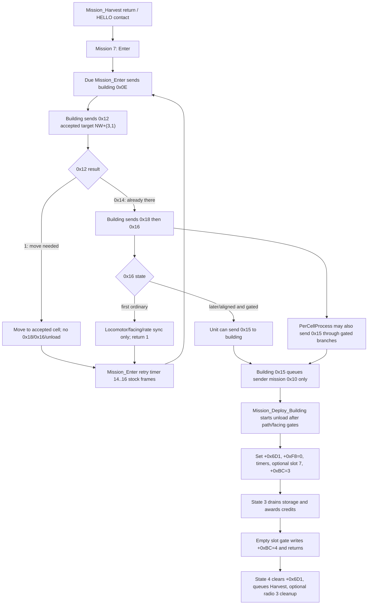

# Stock Refinery Dock/Unload Lifecycle Doc Map

Date: 2026-05-24
Scope: stock YR `CMIN/HARV -> GAREFN/NAREFN` refinery return, dock admission, unload, display, exit, and queue contention.
Status: ordered entry point for new implementation/research sessions.

This file groups the refinery dock/unload research docs by lifecycle stage and authority. It does not replace the underlying reports. Use it to avoid mixing older hypotheses with the settled stock `gamemd.exe` model.

## Core Problem

The long-running bug is not just a wrong pad coordinate. It is a state-boundary problem.

Older Rust/docs tended to collapse several stock stages into one "arrived at pad, link/start unload" event. Current evidence says stock YR splits this into:

1. `Mission_Enter` retry scheduling.
2. building `CAN_DOCK(0x0E)` admission.
3. accepted movement target `NW+(3,1)`.
4. contact flag setup by `0x18`.
5. first `0x16` timing/facing sync.
6. later retry-driven `0x16` or per-cell `0x15` handoff.
7. building `0x15` queuing mission `0x10`.
8. `Mission_Deploy_Building` starting actual unload state.
9. state-3 drain/display.
10. state-4 cleanup and return to Harvest.

The implementation risk is naming one Rust phase or field as "pad/link/on-pad" and then letting it absorb side effects that stock spreads across these stages.

## Authority Labels

| Label | Meaning |
|---|---|
| `CANONICAL` | Use as the current wording source for this lifecycle. |
| `PRIMARY` | Focused Ghidra/INI/Rust evidence for one stage. |
| `SUPPORTING` | Useful for a narrower branch or corroboration. |
| `EDGE` | Destroyed/sold/interrupted/two-miner/modded branch; do not generalize to normal stock completion. |
| `STALE_IN_PART` | Contains useful facts but has outdated wording or conclusions. |
| `SUPERSEDED` | Do not implement from this doc unless re-verified. |

## New Session Read Order

Read these first, in this order:

| Order | Doc | Role |
|---:|---|---|
| 1 | [miner/STOCK_REFINERY_DOCK_UNLOAD_STATE_MACHINE_CURRENT_SYSTEM_MODEL_SYNTHESIS.md](https://github.com/YuriPlanet/vera20k/blob/1dbaf80c89c9348df493ab618dbefed8663aef96/docs/research/miner/STOCK_REFINERY_DOCK_UNLOAD_STATE_MACHINE_CURRENT_SYSTEM_MODEL_SYNTHESIS.md) | `CANONICAL`: one-screen stock flow and do-not-implement list. |
| 2 | [ACCEPTED_CELL_GETDOCKCOORD_QUEUEINGCELL_DOC_CLUSTER_AUDIT_GHIDRA_REPORT.md](https://github.com/YuriPlanet/vera20k/blob/108924bc237d14342b68b8bb78f2bba0400d2443/docs/research/ACCEPTED_CELL_GETDOCKCOORD_QUEUEINGCELL_DOC_CLUSTER_AUDIT_GHIDRA_REPORT.md) | `CANONICAL`: reconciles accepted `NW+(3,1)`, `GetDockCoord` `NW+(2,1)`, and `QueueingCell=4,1`. |
| 3 | [REFINERY_ENTER_RETRY_TIMER_IMPLEMENTATION_VERIFICATION_GHIDRA_REPORT.md](https://github.com/YuriPlanet/vera20k/blob/108924bc237d14342b68b8bb78f2bba0400d2443/docs/research/REFINERY_ENTER_RETRY_TIMER_IMPLEMENTATION_VERIFICATION_GHIDRA_REPORT.md) | `PRIMARY`: stock `[Enter] Rate * 900 + RandomRanged(0,2)` retry timing and Rust deltas. |
| 4 | [UNITCLASS_RECEIVE_RADIO_0X16_SECOND_CALL_SCHEDULING_GHIDRA_REPORT.md](https://github.com/YuriPlanet/vera20k/blob/108924bc237d14342b68b8bb78f2bba0400d2443/docs/research/UNITCLASS_RECEIVE_RADIO_0X16_SECOND_CALL_SCHEDULING_GHIDRA_REPORT.md) | `PRIMARY`: first `0x16` vs later retry-driven `0x16`. |
| 5 | [RADIO_0X18_CONTACT_FLAG_LIFECYCLE_GHIDRA_REPORT.md](https://github.com/YuriPlanet/vera20k/blob/108924bc237d14342b68b8bb78f2bba0400d2443/docs/research/RADIO_0X18_CONTACT_FLAG_LIFECYCLE_GHIDRA_REPORT.md) | `PRIMARY`: `+0x418` contact state and clear paths. |
| 6 | [RADIO_0X15_START_UNLOAD_SIDE_EFFECTS_GHIDRA_REPORT.md](https://github.com/YuriPlanet/vera20k/blob/108924bc237d14342b68b8bb78f2bba0400d2443/docs/research/RADIO_0X15_START_UNLOAD_SIDE_EFFECTS_GHIDRA_REPORT.md) | `PRIMARY`: `0x15` only queues mission `0x10` in stock DockUnload. |
| 7 | [REFINERY_PAD_LINK_OCCUPANCY_LIFECYCLE_IMPLEMENTATION_VERIFICATION_GHIDRA_REPORT.md](https://github.com/YuriPlanet/vera20k/blob/108924bc237d14342b68b8bb78f2bba0400d2443/docs/research/REFINERY_PAD_LINK_OCCUPANCY_LIFECYCLE_IMPLEMENTATION_VERIFICATION_GHIDRA_REPORT.md) | `PRIMARY`: no stock physical `on_pad` / `+0x2E4` link for normal unload. |
| 8 | [STOCK_MISSION_DEPLOY_BUILDING_REFINERY_UNLOAD_REACHABILITY_GHIDRA_REPORT.md](https://github.com/YuriPlanet/vera20k/blob/108924bc237d14342b68b8bb78f2bba0400d2443/docs/research/STOCK_MISSION_DEPLOY_BUILDING_REFINERY_UNLOAD_REACHABILITY_GHIDRA_REPORT.md) | `PRIMARY`: mission `0x10`, zero-link unload state 3/4, `+0x6D1`, `+0xBC`. |
| 9 | [REFINERY_DOCK_DEPLOY_SOUND_ANIM_TIMING_IMPLEMENTATION_VERIFICATION_GHIDRA_REPORT.md](https://github.com/YuriPlanet/vera20k/blob/108924bc237d14342b68b8bb78f2bba0400d2443/docs/research/REFINERY_DOCK_DEPLOY_SOUND_ANIM_TIMING_IMPLEMENTATION_VERIFICATION_GHIDRA_REPORT.md) | `PRIMARY`: no stock DockDeploy sound; slot 7 timing and stock no-op. |
| 10 | [miner/HARV_UNLOADING_CLASS_DISPLAY_TIMING_GHIDRA_REPORT.md](https://github.com/YuriPlanet/vera20k/blob/108924bc237d14342b68b8bb78f2bba0400d2443/docs/research/miner/HARV_UNLOADING_CLASS_DISPLAY_TIMING_GHIDRA_REPORT.md) | `PRIMARY`: HARV -> HORV render-time swap through `+0x6D1`. |
| 11 | [miner/HARV_POST_UNLOAD_EXIT_PATH_GHIDRA_REPORT.md](https://github.com/YuriPlanet/vera20k/blob/108924bc237d14342b68b8bb78f2bba0400d2443/docs/research/miner/HARV_POST_UNLOAD_EXIT_PATH_GHIDRA_REPORT.md) | `PRIMARY`: healthy stock state-4 exit, contact cleanup, no `Force_Track(0x47)`. |
| 12 | [DOCKING_QUEUE_EXIT_REFERENCE_POINTS_GHIDRA_REPORT.md](https://github.com/YuriPlanet/vera20k/blob/108924bc237d14342b68b8bb78f2bba0400d2443/docs/research/DOCKING_QUEUE_EXIT_REFERENCE_POINTS_GHIDRA_REPORT.md) | `PRIMARY`: `QueueingCell`, `DockingOffset`, `ExitCoord`, `NumberOfDocks` reference-point split. |

## Settled Lifecycle

## Coordinate And Reference-Point Map

| Name | Stock 4x3 refinery cell | Owner | Use |
|---|---:|---|---|
| Accepted `0x12` target | `NW+(3,1)` | `BuildingClass::Receive_Radio(0x0E)` | The movement cell sent to the miner during accepted stock docking. |
| Art-opened/passable pad cell | `NW+(3,1)` | `artmd.ini RemoveOccupy` | Passability/art fact only; not `GetDockCoord`. |
| `GetDockCoord` equality cell | `NW+(2,1)` | `BuildingClass::GetDockCoord`, `Refinery=yes` branch | Side-check/equality coordinate and one possible per-cell `0x15` source. |
| `QueueingCell` | `NW+(4,1)` | `artmd.ini QueueingCell=4,1` | Fallback/wait/staging seed, not accepted target and not unload exit. |
| Normal stock exit destination | none installed | `Mission_Deploy_Building` state 4 | Healthy stock cargo-empty exit does not set a new `QueueingCell`/`Force_Track` destination. |
| Conditional reciprocal-link release | `NW+(-1,+1)` seed plus `(-0x80,+0x80)` lepton prelude | `ReleaseDockedHarvester` | Conditional/nonzero-link/interrupt-style branch; not normal stock completion. |

## Field Ownership Map

| Field/list | Owner | Stock role |
|---|---|---|
| `RadioClass +0xE4/+0xE8` | radio endpoint | Contact array and contact capacity. This owns admission serialization. |
| `Techno +0x418` | unit/building endpoint | Contact-entered flag set by `0x18`, cleared by `0x19` cascades. Not unload-active. |
| `Unit +0x5A4` | Foot/NavCom | Destination pointer used by `0x16` and per-cell gates. |
| `Unit +0x2E4` | unit | Reciprocal-link branch selector. Stock DockUnload does not write it. |
| `Building +0x2E4/+0x718` | building | Conditional release-helper state. Not normal stock zero-link unload. |
| `Unit +0x6D1` | unit | Unload-active/render latch set by mission `0x10`, cleared by state 4. |
| `Unit +0xBC` | mission substate | `3` for dump state, `4` for post-empty exit state. |
| `Unit +0xF8` | unit | Dump-rate accumulator, zeroed at unload init. |
| `Unit +0x100..+0x10C` | unit | Timer fields initialized at unload init. |
| `Mission +0xC8/+0xD0` | mission class | start frame and duration for mission dispatch timing. |
| `Building +0x57C` | building | slot-8/ProductionAnim wait guard before state-4 clears `+0x6D1`. |
| `Building +0x584` | building | slot-10/SpecialAnim pointer cleared on state-3 empty transition. |

## Stage Doc Groups

### A. Coordinate / Admission

| Doc | Authority | Use |
|---|---|---|
| [ACCEPTED_CELL_GETDOCKCOORD_QUEUEINGCELL_DOC_CLUSTER_AUDIT_GHIDRA_REPORT.md](https://github.com/YuriPlanet/vera20k/blob/108924bc237d14342b68b8bb78f2bba0400d2443/docs/research/ACCEPTED_CELL_GETDOCKCOORD_QUEUEINGCELL_DOC_CLUSTER_AUDIT_GHIDRA_REPORT.md) | `CANONICAL` | Current wording for the three-cell split and stale wording audit. |
| [DOCKING_QUEUE_EXIT_REFERENCE_POINTS_GHIDRA_REPORT.md](https://github.com/YuriPlanet/vera20k/blob/108924bc237d14342b68b8bb78f2bba0400d2443/docs/research/DOCKING_QUEUE_EXIT_REFERENCE_POINTS_GHIDRA_REPORT.md) | `PRIMARY` | Parser units and reference-point consumers for `QueueingCell`, `DockingOffset`, `ExitCoord`, `NumberOfDocks`. |
| [BUILDING_RECEIVE_RADIO_0E_STOCK_REFINERY_CANDOCK_CELL_GHIDRA_REPORT.md](https://github.com/YuriPlanet/vera20k/blob/108924bc237d14342b68b8bb78f2bba0400d2443/docs/research/BUILDING_RECEIVE_RADIO_0E_STOCK_REFINERY_CANDOCK_CELL_GHIDRA_REPORT.md) | `STALE_IN_PART` | Correct for accepted `NW+(3,1)`; stale where it implies `+0x16BC` is the stock refinery `GetDockCoord` flag. |
| [BUILDINGCLASS_GETDOCKCOORD_STOCK_REFINERY_BRANCH_GHIDRA_REPORT.md](https://github.com/YuriPlanet/vera20k/blob/108924bc237d14342b68b8bb78f2bba0400d2443/docs/research/BUILDINGCLASS_GETDOCKCOORD_STOCK_REFINERY_BRANCH_GHIDRA_REPORT.md) | `PRIMARY` | Stock `GetDockCoord` branch proof. |
| [BUILDING_RECEIVE_RADIO_0E_GETDOCKCOORD_SIDE_CHECK_GHIDRA_REPORT.md](https://github.com/YuriPlanet/vera20k/blob/108924bc237d14342b68b8bb78f2bba0400d2443/docs/research/BUILDING_RECEIVE_RADIO_0E_GETDOCKCOORD_SIDE_CHECK_GHIDRA_REPORT.md) | `SUPPORTING` | Early side-check inside `0x0E`; not the accepted target. |
| [REFINERY_DOCK_PAD_CAN_ENTER_CELL_STACK_GHIDRA_REPORT.md](https://github.com/YuriPlanet/vera20k/blob/108924bc237d14342b68b8bb78f2bba0400d2443/docs/research/pathfinding/REFINERY_DOCK_PAD_CAN_ENTER_CELL_STACK_GHIDRA_REPORT.md) | `SUPPORTING` | Can-enter/passability stack around the refinery pad. |
| [STOCK_REFINERY_ART_REMOVE_OCCUPY_PAD_CELL_GHIDRA_REPORT.md](https://github.com/YuriPlanet/vera20k/blob/108924bc237d14342b68b8bb78f2bba0400d2443/docs/research/STOCK_REFINERY_ART_REMOVE_OCCUPY_PAD_CELL_GHIDRA_REPORT.md) | `SUPPORTING` | Art-opened `NW+(3,1)` pad/passability fact. |
| [coord-cell-conversions/fn-building-getdockcoord.md](https://github.com/YuriPlanet/vera20k/blob/108924bc237d14342b68b8bb78f2bba0400d2443/docs/research/coord-cell-conversions/fn-building-getdockcoord.md) | `STALE_IN_PART` | Mostly correct; avoid wording that makes `NW+(2,1)` required for every unload. |
| [coord-cell-conversions/_system.md](https://github.com/YuriPlanet/vera20k/blob/108924bc237d14342b68b8bb78f2bba0400d2443/docs/research/coord-cell-conversions/_system.md) | `SUPPORTING` | Broader coordinate synthesis; current for this split after latest updates. |

### B. Mission Enter Retry

| Doc | Authority | Use |
|---|---|---|
| [REFINERY_ENTER_RETRY_TIMER_IMPLEMENTATION_VERIFICATION_GHIDRA_REPORT.md](https://github.com/YuriPlanet/vera20k/blob/108924bc237d14342b68b8bb78f2bba0400d2443/docs/research/REFINERY_ENTER_RETRY_TIMER_IMPLEMENTATION_VERIFICATION_GHIDRA_REPORT.md) | `PRIMARY` | Exact retry formula, start/duration storage, Rust timer deltas. |
| [MISSIONENTER_RETRY_TIMER_STORAGE_AND_DISPATCH_GHIDRA_REPORT.md](https://github.com/YuriPlanet/vera20k/blob/108924bc237d14342b68b8bb78f2bba0400d2443/docs/research/MISSIONENTER_RETRY_TIMER_STORAGE_AND_DISPATCH_GHIDRA_REPORT.md) | `PRIMARY` | Mission dispatcher timer storage and due logic. |
| [FOOTCLASS_MISSION_ENTER_0X0E_REPEAT_TIMING_GHIDRA_REPORT.md](https://github.com/YuriPlanet/vera20k/blob/108924bc237d14342b68b8bb78f2bba0400d2443/docs/research/FOOTCLASS_MISSION_ENTER_0X0E_REPEAT_TIMING_GHIDRA_REPORT.md) | `PRIMARY` | One `0x0E` per dispatch and repeat timing. |
| [UNIT_MISSION_ENTER_REFINERY_RETRY_QUEUE_LOOP_GHIDRA_REPORT.md](https://github.com/YuriPlanet/vera20k/blob/108924bc237d14342b68b8bb78f2bba0400d2443/docs/research/UNIT_MISSION_ENTER_REFINERY_RETRY_QUEUE_LOOP_GHIDRA_REPORT.md) | `SUPPORTING` | Refinery retry loop context. |
| [miner/MISSION_ENTER_REFINERY_DOCK_GHIDRA_REPORT.md](https://github.com/YuriPlanet/vera20k/blob/108924bc237d14342b68b8bb78f2bba0400d2443/docs/research/miner/MISSION_ENTER_REFINERY_DOCK_GHIDRA_REPORT.md) | `STALE_IN_PART` | Useful older Mission Enter facts; check wording against the current three-cell split. |
| [miner/MISSION_ENTER_CANDOCK_RETRY_SAME_FRAME_ORDER_GHIDRA_REPORT.md](https://github.com/YuriPlanet/vera20k/blob/108924bc237d14342b68b8bb78f2bba0400d2443/docs/research/miner/MISSION_ENTER_CANDOCK_RETRY_SAME_FRAME_ORDER_GHIDRA_REPORT.md) | `SUPPORTING` | Same-frame ordering around `CAN_DOCK` retry. |

### C. Radio Contact And Handoff

| Doc | Authority | Use |
|---|---|---|
| [RADIO_0X18_CONTACT_FLAG_LIFECYCLE_GHIDRA_REPORT.md](https://github.com/YuriPlanet/vera20k/blob/108924bc237d14342b68b8bb78f2bba0400d2443/docs/research/RADIO_0X18_CONTACT_FLAG_LIFECYCLE_GHIDRA_REPORT.md) | `PRIMARY` | `+0x418` set/clear/persistence and consumers. |
| [UNITCLASS_RECEIVE_RADIO_0X16_SECOND_CALL_SCHEDULING_GHIDRA_REPORT.md](https://github.com/YuriPlanet/vera20k/blob/108924bc237d14342b68b8bb78f2bba0400d2443/docs/research/UNITCLASS_RECEIVE_RADIO_0X16_SECOND_CALL_SCHEDULING_GHIDRA_REPORT.md) | `PRIMARY` | First `0x16` vs later retry-driven `0x16`; no self-schedule. |
| [UNITCLASS_RECEIVE_RADIO_0X16_SECOND_CALL_TIMING_GHIDRA_REPORT.md](https://github.com/YuriPlanet/vera20k/blob/108924bc237d14342b68b8bb78f2bba0400d2443/docs/research/UNITCLASS_RECEIVE_RADIO_0X16_SECOND_CALL_TIMING_GHIDRA_REPORT.md) | `PRIMARY` | Timing-focused sibling for the later `0x16`. |
| [RADIO_0X15_START_UNLOAD_SIDE_EFFECTS_GHIDRA_REPORT.md](https://github.com/YuriPlanet/vera20k/blob/108924bc237d14342b68b8bb78f2bba0400d2443/docs/research/RADIO_0X15_START_UNLOAD_SIDE_EFFECTS_GHIDRA_REPORT.md) | `PRIMARY` | `0x15` side effects: queue mission `0x10` only for stock DockUnload. |
| [PERCELLPROCESS_ALTERNATE_0X15_PATH_IMPLEMENTATION_VERIFICATION_GHIDRA_REPORT.md](https://github.com/YuriPlanet/vera20k/blob/108924bc237d14342b68b8bb78f2bba0400d2443/docs/research/PERCELLPROCESS_ALTERNATE_0X15_PATH_IMPLEMENTATION_VERIFICATION_GHIDRA_REPORT.md) | `PRIMARY` | Alternate per-cell `0x15` source. |
| [UNITCLASS_PERCELLPROCESS_CONTACT_FLAG_ADJACENT_BUILDING_0X15_BRANCH_GHIDRA_REPORT.md](https://github.com/YuriPlanet/vera20k/blob/108924bc237d14342b68b8bb78f2bba0400d2443/docs/research/UNITCLASS_PERCELLPROCESS_CONTACT_FLAG_ADJACENT_BUILDING_0X15_BRANCH_GHIDRA_REPORT.md) | `PRIMARY` | Adjacent-building `0x15` branch gated by `+0x418`. |
| [UNITCLASS_PERCELLPROCESS_GETDOCKCOORD_VS_0X16_RECONCILIATION_GHIDRA_REPORT.md](https://github.com/YuriPlanet/vera20k/blob/108924bc237d14342b68b8bb78f2bba0400d2443/docs/research/UNITCLASS_PERCELLPROCESS_GETDOCKCOORD_VS_0X16_RECONCILIATION_GHIDRA_REPORT.md) | `PRIMARY` | Reconciles `GetDockCoord` per-cell source with `0x16` source. |
| [RADIOCLASS_CORE_PRIMITIVES_VERIFIED_GHIDRA_REPORT.md](https://github.com/YuriPlanet/vera20k/blob/108924bc237d14342b68b8bb78f2bba0400d2443/docs/research/RADIOCLASS_CORE_PRIMITIVES_VERIFIED_GHIDRA_REPORT.md) | `SUPPORTING` | Generic RadioClass contact primitives. |
| [RADIO_SYSTEM_MODEL_SYNTHESIS.md](https://github.com/YuriPlanet/vera20k/blob/108924bc237d14342b68b8bb78f2bba0400d2443/docs/research/RADIO_SYSTEM_MODEL_SYNTHESIS.md) | `SUPPORTING` | Broader radio model; not refinery-specific enough to override focused reports. |

### D. Mission Deploy / Unload Start

| Doc | Authority | Use |
|---|---|---|
| [STOCK_MISSION_DEPLOY_BUILDING_REFINERY_UNLOAD_REACHABILITY_GHIDRA_REPORT.md](https://github.com/YuriPlanet/vera20k/blob/108924bc237d14342b68b8bb78f2bba0400d2443/docs/research/STOCK_MISSION_DEPLOY_BUILDING_REFINERY_UNLOAD_REACHABILITY_GHIDRA_REPORT.md) | `PRIMARY` | Zero-link reachability, state 3/4, `+0x6D1`, `+0xBC`, `PathType` polarity. |
| [UNIT_MISSION_DEPLOY_BUILDING_UNLOAD_START_IMPLEMENTATION_VERIFICATION_GHIDRA_REPORT.md](https://github.com/YuriPlanet/vera20k/blob/108924bc237d14342b68b8bb78f2bba0400d2443/docs/research/UNIT_MISSION_DEPLOY_BUILDING_UNLOAD_START_IMPLEMENTATION_VERIFICATION_GHIDRA_REPORT.md) | `PRIMARY` | Unload-start implementation handoff. |
| [UNIT_MISSION_DEPLOY_BUILDING_GHIDRA_REPORT.md](https://github.com/YuriPlanet/vera20k/blob/1dbaf80c89c9348df493ab618dbefed8663aef96/docs/research/UNIT_MISSION_DEPLOY_BUILDING_GHIDRA_REPORT.md) | `PRIMARY` | Broader mission `0x10` function context. |
| [MISSION_DEPLOY_BUILDING_0x73D630_STATE_MACHINE_GHIDRA_REPORT.md](https://github.com/YuriPlanet/vera20k/blob/108924bc237d14342b68b8bb78f2bba0400d2443/docs/research/MISSION_DEPLOY_BUILDING_0x73D630_STATE_MACHINE_GHIDRA_REPORT.md) | `PRIMARY` | State-machine body context. |
| [MISSION_DEPLOY_BUILDING_DOCKED_VS_UNDOCKED_BRANCH_GHIDRA_REPORT.md](https://github.com/YuriPlanet/vera20k/blob/108924bc237d14342b68b8bb78f2bba0400d2443/docs/research/MISSION_DEPLOY_BUILDING_DOCKED_VS_UNDOCKED_BRANCH_GHIDRA_REPORT.md) | `PRIMARY` | `+0x2E4` branch split. |
| `miner/MISSION_DEPLOY_BUILDING_REFINERY_UNLOAD_GHIDRA_REPORT.md` | `SUPPORTING` | Older refinery unload body facts. |
| [miner/MISSION_DEPLOY_BUILDING_REFINERY_UNLOAD_STATE3_STATE4_TIMING_GHIDRA_REPORT.md](https://github.com/YuriPlanet/vera20k/blob/108924bc237d14342b68b8bb78f2bba0400d2443/docs/research/miner/MISSION_DEPLOY_BUILDING_REFINERY_UNLOAD_STATE3_STATE4_TIMING_GHIDRA_REPORT.md) | `SUPPORTING` | State 3/4 timing details. |
| [miner/STOCK_MISSION_DEPLOY_BUILDING_REFINERY_UNLOAD_PATHTYPE_STATE4_GHIDRA_REPORT.md](https://github.com/YuriPlanet/vera20k/blob/1dbaf80c89c9348df493ab618dbefed8663aef96/docs/research/miner/STOCK_MISSION_DEPLOY_BUILDING_REFINERY_UNLOAD_PATHTYPE_STATE4_GHIDRA_REPORT.md) | `SUPPORTING` | PathType/state-4 details. |
| [miner/EMPTY_SLOT_UNLOAD_GATE_TO_STATE4_RELEASE_TIMING_GHIDRA_REPORT.md](https://github.com/YuriPlanet/vera20k/blob/108924bc237d14342b68b8bb78f2bba0400d2443/docs/research/miner/EMPTY_SLOT_UNLOAD_GATE_TO_STATE4_RELEASE_TIMING_GHIDRA_REPORT.md) | `SUPPORTING` | Empty-slot transition to state 4. |

### E. Sound / Animation / Display / Credits

| Doc | Authority | Use |
|---|---|---|
| [REFINERY_DOCK_DEPLOY_SOUND_ANIM_TIMING_IMPLEMENTATION_VERIFICATION_GHIDRA_REPORT.md](https://github.com/YuriPlanet/vera20k/blob/108924bc237d14342b68b8bb78f2bba0400d2443/docs/research/REFINERY_DOCK_DEPLOY_SOUND_ANIM_TIMING_IMPLEMENTATION_VERIFICATION_GHIDRA_REPORT.md) | `PRIMARY` | No stock DockDeploy sound; slot 7 call timing and stock no-op. |
| [miner/HARV_UNLOADING_CLASS_DISPLAY_TIMING_GHIDRA_REPORT.md](https://github.com/YuriPlanet/vera20k/blob/108924bc237d14342b68b8bb78f2bba0400d2443/docs/research/miner/HARV_UNLOADING_CLASS_DISPLAY_TIMING_GHIDRA_REPORT.md) | `PRIMARY` | HORV display gate: render-time swap when `+0x6D1 != 0`. |
| [UNLOADINGCLASS_RENDER_ORIENTATION_GHIDRA_REPORT.md](https://github.com/YuriPlanet/vera20k/blob/108924bc237d14342b68b8bb78f2bba0400d2443/docs/research/UNLOADINGCLASS_RENDER_ORIENTATION_GHIDRA_REPORT.md) | `SUPPORTING` | Rendering/orientation follow-up for UnloadingClass. |
| `miner/REFINERY_DOCK_ANIM_SLOTS_GHIDRA_REPORT.md` | `SUPPORTING` | Refinery anim slot details. |
| `miner/REFINERY_STORAGE_FLOW_GHIDRA_REPORT.md` | `PRIMARY` | Storage/deposit flow. |
| [miner/ORE_VALUE_CREDIT_DEPOSIT_GHIDRA_REPORT.md](https://github.com/YuriPlanet/vera20k/blob/108924bc237d14342b68b8bb78f2bba0400d2443/docs/research/miner/ORE_VALUE_CREDIT_DEPOSIT_GHIDRA_REPORT.md) | `PRIMARY` | Credit award values. |
| [ADD_TIBERIUM_CREDITS_PURIFIER_VIRTUAL_PURIFIERS_GHIDRA_REPORT.md](https://github.com/YuriPlanet/vera20k/blob/108924bc237d14342b68b8bb78f2bba0400d2443/docs/research/ADD_TIBERIUM_CREDITS_PURIFIER_VIRTUAL_PURIFIERS_GHIDRA_REPORT.md) | `PRIMARY` | Purifier/credit modifiers and `Math__ftol` corroboration. |
| `HARVEST_ORE_TICK_TIMING_PARTIAL_FULL_EDGE_CASES_ORE_GEMS_GHIDRA_REPORT.md` | `SUPPORTING` | Harvest/cargo edge behavior outside docking. |

### F. Healthy Exit / Contact Cleanup

| Doc | Authority | Use |
|---|---|---|
| [miner/HARV_POST_UNLOAD_EXIT_PATH_GHIDRA_REPORT.md](https://github.com/YuriPlanet/vera20k/blob/108924bc237d14342b68b8bb78f2bba0400d2443/docs/research/miner/HARV_POST_UNLOAD_EXIT_PATH_GHIDRA_REPORT.md) | `PRIMARY` | Healthy state-4 exit and contact cleanup. |
| [BUILDINGCLASS_0X57C_DOCK_DEPART_GUARD_NAVCOM_GHIDRA_REPORT.md](https://github.com/YuriPlanet/vera20k/blob/108924bc237d14342b68b8bb78f2bba0400d2443/docs/research/BUILDINGCLASS_0X57C_DOCK_DEPART_GUARD_NAVCOM_GHIDRA_REPORT.md) | `PRIMARY` | Slot-8 depart wait guard. |
| [miner/BUILDINGCLASS_0X57C_DOCK_DEPART_GUARD_GHIDRA_REPORT.md](https://github.com/YuriPlanet/vera20k/blob/108924bc237d14342b68b8bb78f2bba0400d2443/docs/research/miner/BUILDINGCLASS_0X57C_DOCK_DEPART_GUARD_GHIDRA_REPORT.md) | `SUPPORTING` | Same guard in miner folder. |
| [miner/REFINERY_DOCK_EXIT_CHAIN_VERIFIED_GHIDRA_REPORT.md](https://github.com/YuriPlanet/vera20k/blob/108924bc237d14342b68b8bb78f2bba0400d2443/docs/research/miner/REFINERY_DOCK_EXIT_CHAIN_VERIFIED_GHIDRA_REPORT.md) | `SUPPORTING` | Exit-chain corroboration. |
| [miner/CHRONO_MINER_POST_UNLOAD_EXIT_ANCHOR_GHIDRA_REPORT.md](https://github.com/YuriPlanet/vera20k/blob/108924bc237d14342b68b8bb78f2bba0400d2443/docs/research/miner/CHRONO_MINER_POST_UNLOAD_EXIT_ANCHOR_GHIDRA_REPORT.md) | `STALE_IN_PART` | Useful chrono context; do not use to make healthy stock exit a `Force_Track` path. |

### G. Two-Miner / Queue Contention

| Doc | Authority | Use |
|---|---|---|
| [miner/TWO_MINER_ONE_REFINERY_ZERO_LINK_HANDOFF_TIMING_GHIDRA_REPORT.md](https://github.com/YuriPlanet/vera20k/blob/108924bc237d14342b68b8bb78f2bba0400d2443/docs/research/miner/TWO_MINER_ONE_REFINERY_ZERO_LINK_HANDOFF_TIMING_GHIDRA_REPORT.md) | `EDGE` | Two-miner handoff timing. |
| [miner/TWO_MINER_ONE_REFINERY_ZERO_LINK_HANDOFF_FRAME_ORDER_GHIDRA_REPORT.md](https://github.com/YuriPlanet/vera20k/blob/108924bc237d14342b68b8bb78f2bba0400d2443/docs/research/miner/TWO_MINER_ONE_REFINERY_ZERO_LINK_HANDOFF_FRAME_ORDER_GHIDRA_REPORT.md) | `EDGE` | Frame order for two-miner handoff. |
| [miner/TWO_CMIN_ONE_REFINERY_TAKEOVER_TIMING_GHIDRA_REPORT.md](https://github.com/YuriPlanet/vera20k/blob/108924bc237d14342b68b8bb78f2bba0400d2443/docs/research/miner/TWO_CMIN_ONE_REFINERY_TAKEOVER_TIMING_GHIDRA_REPORT.md) | `EDGE` | Chrono two-miner takeover. |
| [miner/TWO_CMIN_TAKEOVER_FRAME_ORDER_RETRY_GHIDRA_REPORT.md](https://github.com/YuriPlanet/vera20k/blob/108924bc237d14342b68b8bb78f2bba0400d2443/docs/research/miner/TWO_CMIN_TAKEOVER_FRAME_ORDER_RETRY_GHIDRA_REPORT.md) | `EDGE` | Retry/frame-order detail. |
| [miner/LIVE_OBJECT_VECTOR_ORDER_TWO_MINERS_REFINERY_GHIDRA_REPORT.md](https://github.com/YuriPlanet/vera20k/blob/108924bc237d14342b68b8bb78f2bba0400d2443/docs/research/miner/LIVE_OBJECT_VECTOR_ORDER_TWO_MINERS_REFINERY_GHIDRA_REPORT.md) | `EDGE` | Live object order effect. |
| [CHRONO_MINER_REFINERY_CONTACT_SATURATION_QUEUE_EVICTION_GHIDRA_REPORT.md](https://github.com/YuriPlanet/vera20k/blob/108924bc237d14342b68b8bb78f2bba0400d2443/docs/research/CHRONO_MINER_REFINERY_CONTACT_SATURATION_QUEUE_EVICTION_GHIDRA_REPORT.md) | `EDGE` | Contact saturation/queue eviction context. |
| [miner/CURRENT_RUST_TWO_MINER_TESTS_VS_BINARY_RULE_GHIDRA_REPORT.md](https://github.com/YuriPlanet/vera20k/blob/108924bc237d14342b68b8bb78f2bba0400d2443/docs/research/miner/CURRENT_RUST_TWO_MINER_TESTS_VS_BINARY_RULE_GHIDRA_REPORT.md) | `EDGE` | Rust test comparison for two-miner rules. |
| [miner/WAITING_MINER_MISSION_TIMER_AFTER_BUSY_CANDOCK_GHIDRA_REPORT.md](https://github.com/YuriPlanet/vera20k/blob/108924bc237d14342b68b8bb78f2bba0400d2443/docs/research/miner/WAITING_MINER_MISSION_TIMER_AFTER_BUSY_CANDOCK_GHIDRA_REPORT.md) | `EDGE` | Busy/waiting retry timer behavior. |

### H. Interrupt / Destroyed / Sold / Conditional Release

| Doc | Authority | Use |
|---|---|---|
| [miner/HARV_DESTROYED_REFINERY_UNLOAD_ABORT_GHIDRA_REPORT.md](https://github.com/YuriPlanet/vera20k/blob/108924bc237d14342b68b8bb78f2bba0400d2443/docs/research/miner/HARV_DESTROYED_REFINERY_UNLOAD_ABORT_GHIDRA_REPORT.md) | `EDGE` | Destroyed-refinery abort behavior. |
| [miner/MISSING_DESTROYED_REFINERY_MID_UNLOAD_ORDERING_GHIDRA_REPORT.md](https://github.com/YuriPlanet/vera20k/blob/108924bc237d14342b68b8bb78f2bba0400d2443/docs/research/miner/MISSING_DESTROYED_REFINERY_MID_UNLOAD_ORDERING_GHIDRA_REPORT.md) | `EDGE` | Missing/destroyed mid-unload ordering. |
| [miner/REFINERY_DESTROYED_OR_SOLD_MID_UNLOAD_CONTACTS_DISPLAY_CREDITS_GHIDRA_REPORT.md](https://github.com/YuriPlanet/vera20k/blob/108924bc237d14342b68b8bb78f2bba0400d2443/docs/research/miner/REFINERY_DESTROYED_OR_SOLD_MID_UNLOAD_CONTACTS_DISPLAY_CREDITS_GHIDRA_REPORT.md) | `EDGE` | Contacts/display/credits during loss. |
| [miner/REFINERY_SOLD_DESTROYED_MID_UNLOAD_RUNTIME_EFFECTS_GHIDRA_REPORT.md](https://github.com/YuriPlanet/vera20k/blob/108924bc237d14342b68b8bb78f2bba0400d2443/docs/research/miner/REFINERY_SOLD_DESTROYED_MID_UNLOAD_RUNTIME_EFFECTS_GHIDRA_REPORT.md) | `EDGE` | Runtime effects of sold/destroyed refinery. |
| [miner/UNLOAD_VISUAL_STALE_FRAME_AFTER_REFINERY_LOSS_GHIDRA_REPORT.md](https://github.com/YuriPlanet/vera20k/blob/108924bc237d14342b68b8bb78f2bba0400d2443/docs/research/miner/UNLOAD_VISUAL_STALE_FRAME_AFTER_REFINERY_LOSS_GHIDRA_REPORT.md) | `EDGE` | Stale visual frame risk. |
| [miner/BUILDING_UNDOCKUNIT_0x4593A0_CHRONO_MINER_GHIDRA_REPORT.md](https://github.com/YuriPlanet/vera20k/blob/108924bc237d14342b68b8bb78f2bba0400d2443/docs/research/miner/BUILDING_UNDOCKUNIT_0x4593A0_CHRONO_MINER_GHIDRA_REPORT.md) | `EDGE` | Interrupt/undock helper, not healthy stock completion. |
| [miner/RELEASEDOCKEDHARVESTER_0x4595C0_GHIDRA_REPORT.md](https://github.com/YuriPlanet/vera20k/blob/108924bc237d14342b68b8bb78f2bba0400d2443/docs/research/miner/RELEASEDOCKEDHARVESTER_0x4595C0_GHIDRA_REPORT.md) | `EDGE` | Conditional reciprocal-link release helper. |
| [RELEASEDOCKEDHARVESTER_EXIT_ANCHOR_RECHECK_GHIDRA_REPORT.md](https://github.com/YuriPlanet/vera20k/blob/108924bc237d14342b68b8bb78f2bba0400d2443/docs/research/RELEASEDOCKEDHARVESTER_EXIT_ANCHOR_RECHECK_GHIDRA_REPORT.md) | `EDGE` | Conditional release anchor recheck. |
| [miner/STANDARD_REFINERY_0X2E4_WRITER_INVENTORY_GHIDRA_REPORT.md](https://github.com/YuriPlanet/vera20k/blob/108924bc237d14342b68b8bb78f2bba0400d2443/docs/research/miner/STANDARD_REFINERY_0X2E4_WRITER_INVENTORY_GHIDRA_REPORT.md) | `PRIMARY` | Writer inventory proving stock `+0x2E4` absence/conditionality. |

### I. Stale / Superseded Watchlist

| Doc | Authority | Problem |
|---|---|---|
| [miner/DOCK_ARRIVAL_PIVOT_SEQUENCE_GHIDRA_REPORT.md](https://github.com/YuriPlanet/vera20k/blob/108924bc237d14342b68b8bb78f2bba0400d2443/docs/research/miner/DOCK_ARRIVAL_PIVOT_SEQUENCE_GHIDRA_REPORT.md) | `STALE_IN_PART` | Old conclusions around arrival/pivot need conflict-audit corrections. |
| [miner/DOCK_ARRIVAL_PIVOT_SEQUENCE_DOC_CONFLICT_AUDIT_GHIDRA_REPORT.md](https://github.com/YuriPlanet/vera20k/blob/108924bc237d14342b68b8bb78f2bba0400d2443/docs/research/miner/DOCK_ARRIVAL_PIVOT_SEQUENCE_DOC_CONFLICT_AUDIT_GHIDRA_REPORT.md) | `CANONICAL_FOR_STALENESS` | Use this audit to interpret the stale pivot doc. |
| [miner/RADIO_LINK_REFINERY_DOCK_STATE_MACHINE_GHIDRA_REPORT.md](https://github.com/YuriPlanet/vera20k/blob/108924bc237d14342b68b8bb78f2bba0400d2443/docs/research/miner/RADIO_LINK_REFINERY_DOCK_STATE_MACHINE_GHIDRA_REPORT.md) | `STALE_IN_PART` | Old radio/link wording can collapse stages. |
| [miner/RADIO_LINK_REFINERY_DOCK_STATE_MACHINE_DOC_CONFLICT_AUDIT_GHIDRA_REPORT.md](https://github.com/YuriPlanet/vera20k/blob/108924bc237d14342b68b8bb78f2bba0400d2443/docs/research/miner/RADIO_LINK_REFINERY_DOCK_STATE_MACHINE_DOC_CONFLICT_AUDIT_GHIDRA_REPORT.md) | `CANONICAL_FOR_STALENESS` | Use this audit to interpret the stale radio-link doc. |
| [miner/HARVESTER_DOCK_UNLOAD.md](https://github.com/YuriPlanet/vera20k/blob/1dbaf80c89c9348df493ab618dbefed8663aef96/docs/research/miner/HARVESTER_DOCK_UNLOAD.md) | `SUPERSEDED` | Older narrative; do not implement from it without rechecking. |
| [miner/HARVESTER_DOCK_UNLOAD_SEQUENCE.md](https://github.com/YuriPlanet/vera20k/blob/108924bc237d14342b68b8bb78f2bba0400d2443/docs/research/miner/HARVESTER_DOCK_UNLOAD_SEQUENCE.md) | `SUPERSEDED` | Older sequence; do not implement from it without rechecking. |
| [CHRONO_MINER_REFINERY_DOCK_UNLOAD_SYSTEM_MODEL_SYNTHESIS.md](https://github.com/YuriPlanet/vera20k/blob/108924bc237d14342b68b8bb78f2bba0400d2443/docs/research/CHRONO_MINER_REFINERY_DOCK_UNLOAD_SYSTEM_MODEL_SYNTHESIS.md) | `STALE_IN_PART` | Useful older synthesis; current stock split is in [miner/STOCK_REFINERY_DOCK_UNLOAD_STATE_MACHINE_CURRENT_SYSTEM_MODEL_SYNTHESIS.md](https://github.com/YuriPlanet/vera20k/blob/1dbaf80c89c9348df493ab618dbefed8663aef96/docs/research/miner/STOCK_REFINERY_DOCK_UNLOAD_STATE_MACHINE_CURRENT_SYSTEM_MODEL_SYNTHESIS.md). |
| `coord-cell-conversions` docs mentioning a physical `NW+3 -> NW+2` bridge | `SUPERSEDED_FOR_THIS_CLAIM` | Replace with accepted `NW+3`, `GetDockCoord` `NW+2`, no physical bridge. |

## Current Implementation-Relevant Deltas To Recheck

These are doc-derived starting points for an implementation session. Re-read current Rust before patching.

| Area | Current expected stock behavior | Likely Rust risk |
|---|---|---|
| Enter retry base | `ftol([Enter] Rate * 900) + RandomRanged(0,2)`, stock `14..16`. | Hardcoded `14`, duration width, missing jitter consumption on successful later handoff. |
| Accepted arrival | Movement to `NW+(3,1)` does not immediately unload. | Any phase that treats accepted-cell arrival as pad link/unload start. |
| First `0x16` | Sync locomotor/facing/rate and return `1`; no `0x15`, no sound, no unload. | `phase_linked` or equivalent doing link/snap/sound/unload too early. |
| `0x18` | Set mirrored `+0x418` contact state only. | Treating contact-entered as physical pad occupancy. |
| `0x15` | Building queues sender mission `0x10` with flag `0` only. | Snapping, cargo drain, deploy sound, display override, or on-pad marking at `0x15` time. |
| Unload start | Mission `0x10` first-entry after gates sets `+0x6D1`, timers, optional slot 7, `+0xBC=3`. | Starting display/sound/drain before mission `0x10` equivalent. |
| Sound | Stock refinery unload does not emit `DockDeploy`; stock slot 7 is unset. | Any unconditional `DockDeploy` sound on unload latch. |
| Display | HARV/HORV swap is render-time while `+0x6D1 != 0`. | Persistent gameplay type mutation or wrong phase timing. |
| Healthy exit | State 3 empty writes state 4 and returns; later state 4 clears `+0x6D1`, queues Harvest, optional radio `3`. | Extra cooldown, forced explicit exit destination, `Force_Track(0x47)`, or FIFO promotion. |
| Queue contention | Waiters retry on their own Mission Enter timer. | Refinery-side promotion or every-tick polling. |

## Negative Facts

- Do not implement a physical move from accepted `NW+(3,1)` to `GetDockCoord` `NW+(2,1)` for every deposit.
- Do not use `GetDockCoord` as the accepted stock `0x12` target.
- Do not use `QueueingCell=4,1` as the accepted target or normal stock exit target.
- Do not collapse `0x18`, `0x16`, `0x15`, and mission `0x10` into a single "linked/on-pad" phase.
- Do not treat `0x18` as unload, pad occupancy, or reciprocal link.
- Do not treat first `0x16 == 1` as unload start.
- Do not play stock `DockDeploy` at first `0x16`, at `0x15`, or at mission `0x10` stock unload latch.
- Do not map normal stock unload to reciprocal `unit/building +0x2E4`.
- Do not call `ReleaseDockedHarvester`, `UndockUnit`, or `Force_Track(0x47)` for healthy stock cargo-empty completion.
- Do not promote waiting miners directly from refinery release; waiters retry on their own timer.

## Completeness Ledger

| Lifecycle area | Status | Notes |
|---|---|---|
| Accepted coordinate split | `COMPLETE_FOR_STOCK` | Current docs agree after the audit. |
| Mission Enter retry | `IMPLEMENTATION_READY_WITH_SMALL_DELTAS` | Formula/storage/RNG are known; Rust must be re-read before patch. |
| `0x18` lifecycle | `COMPLETE_FOR_STOCK` | Runtime clear frame can still matter in edge cases. |
| `0x16` scheduling | `COMPLETE_FOR_STOCK` | Exact visible facing frames may need runtime trace if presentation parity is targeted. |
| `0x15` side effects | `COMPLETE_FOR_STOCK` | Non-stock receiver branches are separate. |
| Mission `0x10` unload start | `COMPLETE_FOR_STOCK` | Path/facing gate and stock latch known. |
| Sound/slot 7 | `COMPLETE_FOR_STOCK` | Modded PreProductionAnim sound remains conditional. |
| HORV/UnloadingClass display | `COMPLETE_FOR_STOCK_STATIC` | Missing-refinery stale-frame duration is runtime-sensitive. |
| Credit/storage drain | `MOSTLY_COMPLETE` | Use storage/credit reports for arithmetic before patching. |
| Healthy exit | `COMPLETE_FOR_STOCK_STATIC` | Same-frame two-miner takeover remains runtime/order-sensitive. |
| Two-miner contention | `EDGE_RUNTIME_SENSITIVE` | Enough to prevent FIFO promotion; exact takeover frame may need traces. |
| Destroyed/sold/interrupted | `EDGE_PARTIAL` | Keep separate from healthy stock completion. |

## Recommended Next Work

1. Make an implementation contract for the bounded Rust fix, using this doc as the map and the `PRIMARY` reports as evidence.
2. Re-read current Rust around `src/sim/miner/miner_dock_sequence.rs`, `src/sim/miner/miner_dock.rs`, and `src/sim/miner/mod.rs`.
3. Patch only the collapsed-stage behavior first: accepted arrival, first `0x16`, `0x15`, mission `0x10` unload start, and DockDeploy sound.
4. Add tests that prove no unload/sound/display starts before the mission `0x10` equivalent.
5. Only after that, tune two-miner exact frame behavior and destroyed/sold edge cases.

